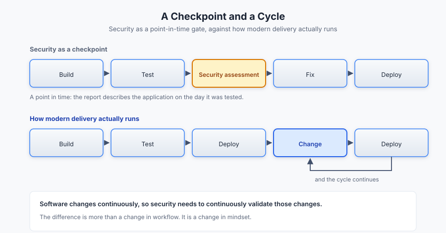
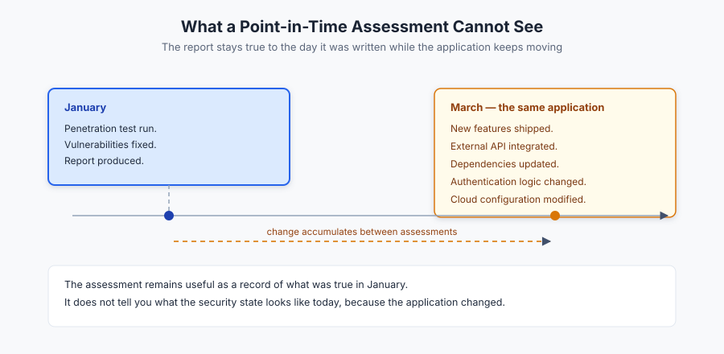
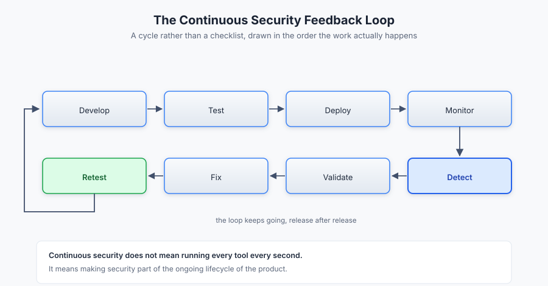
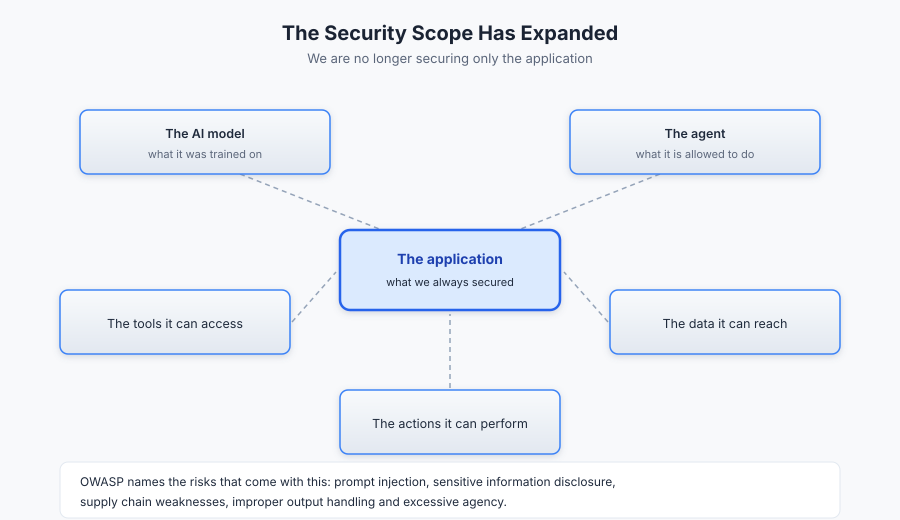
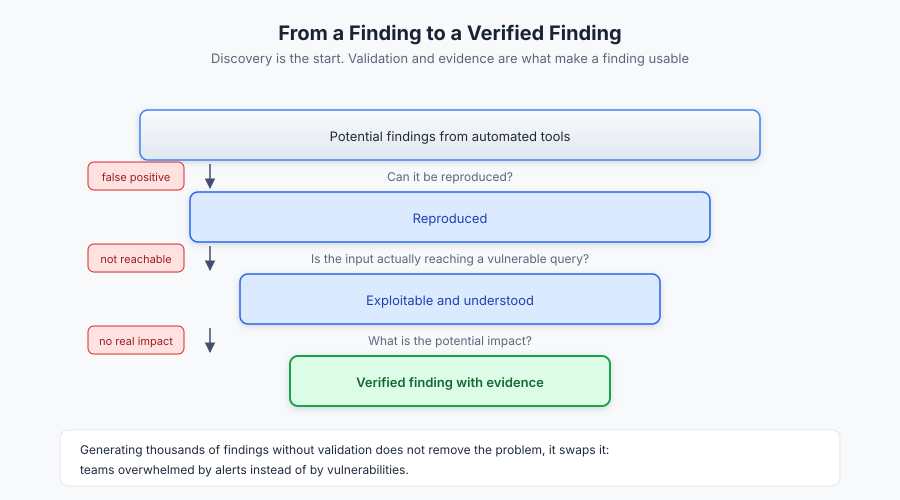
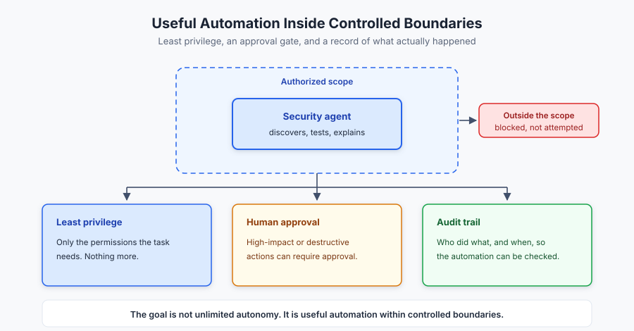

# The New Security Problem: Software Is Being Built Faster Than Ever

Software is being built faster than ever.

The way applications are designed, developed, tested, and deployed has changed significantly. Cloud platforms, open-source technologies, DevOps practices, CI/CD pipelines, and artificial intelligence have made it possible for teams to move from an idea to a working product much faster than before.

AI is accelerating this even further. Developers can now use AI assistants to generate code, write tests, analyze repositories, identify bugs, create documentation, and suggest fixes. More advanced AI agents can perform multi-step tasks and interact with development tools, applications, APIs, and other systems.

For organizations, this creates enormous opportunities. But it also creates a new security problem:

**If software is changing faster than ever, can security keep up?**

Security is still often treated as a point-in-time activity. An application is tested, vulnerabilities are identified and fixed, a report is produced, and the application moves forward. But the application does not stop changing after the assessment.

New features are introduced. Dependencies are updated. APIs are added. Configurations change. Permissions change. Infrastructure changes. AI systems and agents become part of applications.

The security posture of the application can therefore change long after the original security assessment has been completed.

This is where the idea of **continuous security** becomes important.

## The Gap Between Development Speed and Security

For a long time, security could operate as a checkpoint within the software development lifecycle:

**Build → Test → Security Assessment → Fix → Deploy**

Modern development increasingly looks more like:

**Build → Test → Deploy → Change → Deploy → Change → Deploy**

*Figure 1. Security as a point-in-time checkpoint (top) against how modern delivery actually runs (bottom).*

The cycle continues.

Imagine an application that was penetration tested in January. The vulnerabilities discovered during the assessment were fixed, and the organization moved forward.

By March, the development team may have introduced several new features, integrated an external API, updated dependencies, changed authentication logic, or modified the cloud configuration.

*Figure 2. A January assessment stays true to January; by March the application underneath the report has changed.*

The original assessment is still useful, but it represents the security state of the application at a particular point in time. It does not automatically tell us what the security state looks like today.

**Software changes continuously, so security needs to continuously validate those changes.**

## Security Is Not a One-Time Event

A system that is secure today can become vulnerable tomorrow because of a new code change, dependency, configuration, credential, integration, or feature.

This does not make penetration testing, vulnerability assessments, code reviews, audits, or red-team exercises irrelevant. They remain important. The problem is relying on them as the only layer of security.

NIST's Secure Software Development Framework recommends integrating security practices throughout the software development lifecycle rather than treating security as a separate activity performed only at the end.

The mindset therefore needs to shift from:

**“We tested the application.”**

to:

**“We have a process for continuously understanding and improving the security of the application.”**

## What Continuous Security Looks Like

Continuous security does not mean running every security tool every second. It means making security part of the ongoing lifecycle of the product.

A modern security feedback loop can look like:

**Develop → Test → Deploy → Monitor → Detect → Validate → Fix → Retest**

During development, teams can use secure coding practices, static analysis, dependency scanning, and secret detection. Before deployment, infrastructure and configuration can be evaluated. After deployment, applications can continue to be monitored and tested.

When a potential vulnerability is identified, it can be investigated and validated. After remediation, the issue can be tested again to confirm that it has actually been resolved.

*Figure 3. The continuous security feedback loop, drawn as a cycle rather than a checklist.*

The goal is not simply to find more vulnerabilities. It is to **shorten the distance between a security change and the organization's ability to detect, understand, and respond to it.**

## AI Agents Are Changing the Attack Surface

The rise of AI agents makes this challenge even more interesting.

AI agents can potentially do much more than generate code or answer questions. Depending on their configuration, they can interact with tools, APIs, databases, repositories, cloud environments, file systems, and applications.

This introduces another dimension to application security.

Organizations now have to ask:

* What can an AI agent access?
* What tools can it use?
* What actions can it perform?
* What data can it retrieve?
* How are its actions monitored?
* What happens if its instructions are manipulated?
* How are its outputs validated?

OWASP identifies risks associated with generative AI applications such as prompt injection, sensitive information disclosure, supply-chain vulnerabilities, improper output handling, and excessive agency.

The security problem is therefore expanding. We are no longer securing only the application. We may also need to secure the **AI model, the agent, the tools it can access, the data it can reach, and the actions it can perform.**

*Figure 4. The scope of security expands from the application outward to the model, the agent, the tools it can access, the data it can reach and the actions it can perform.*

## More Automation Requires More Verification

AI can help security teams work faster. An agent can potentially discover assets, analyze applications, identify potential vulnerabilities, and assist with security testing.

But there is an important difference between **finding something** and **proving that something is actually a security issue**.

If an automated system reports a potential SQL injection vulnerability, for example, that finding still needs context. Can it be reproduced? Is the input actually reaching a vulnerable query? Can the behavior be exploited? What is the potential impact? Could it be a false positive?

This is where verification becomes important.

A future where security tools generate thousands of findings without sufficient validation could simply replace one problem with another. Instead of being overwhelmed by vulnerabilities, security teams could become overwhelmed by alerts.

Effective automation therefore needs to focus not only on **discovery**, but also on **validation and evidence**.

*Figure 5. From a raw finding to a verified finding: each question filters noise before anything reaches a report.*

## Keeping Security Automation Under Control

There is another consideration when security testing becomes more autonomous.

An agent that can discover a vulnerability is one thing. An agent that can automatically modify systems is another.

The more powerful an agent's capabilities become, the more important appropriate permissions and controls become. Principles such as least privilege remain just as relevant in this environment.

An agent should have only the permissions necessary for the task it is expected to perform. High-impact or destructive actions may also require additional verification or human approval.

The goal should not be unlimited autonomy.

The goal should be **useful automation within controlled boundaries.**

*Figure 6. Useful automation inside controlled boundaries: least privilege, an approval gate for high-impact actions, and an audit trail.*

## From Periodic Testing to Continuous Validation

If modern software is being built and changed continuously, security needs to move closer to that same pace.

A continuous security process can involve:

**Discovery** — knowing what assets, applications, APIs, services, and technologies exist.

**Testing** — regularly evaluating those assets for security weaknesses.

**Validation** — determining whether potential findings are real, reproducible, and meaningful.

**Remediation** — addressing confirmed vulnerabilities.

**Retesting** — checking whether the issue has actually been resolved.

**Monitoring** — continuously watching for changes and new security signals.

This approach does not eliminate traditional penetration testing. It complements it.

A penetration test can provide a deep, human-led assessment at a particular point in time, while continuous security processes help maintain visibility between those assessments.

## Closing the Gap with SecureGraph

This is the gap **SecureGraph is meant to help address**.

As applications become more dynamic and development cycles become shorter, security testing needs to become more automated, scalable, and continuous.

SecureGraph explores this approach through automated security testing and security-agent capabilities designed to assist with activities such as asset discovery, testing, vulnerability identification, and verification.

The important part is not automation for the sake of automation. The bigger question is how security testing can keep pace with applications that are constantly being developed, modified, and deployed.

A security agent that can discover an asset and identify a potential vulnerability is useful. A system that can go further by validating findings, providing evidence, operating within an authorized scope, and producing useful information for remediation becomes much more valuable.

This is where verification becomes especially important.

As AI agents become more capable, organizations need to be able to trust not only **what the agent finds**, but also **how the finding was reached, what evidence supports it, and what the agent is allowed to do next.**

## Security Needs to Move With the Product

The future of application security is unlikely to be about choosing between human security professionals and automation. It will increasingly be about combining both.

Automation can provide scale. AI agents can reduce repetitive work. Security tools can continuously monitor applications.

But humans still provide context, judgment, validation, and accountability.

The goal is a security process where technology helps security teams keep up with the pace of development without removing the controls that make security trustworthy.

That means moving from:

**Build → Assess → Fix → Move On**

toward:

**Build → Test → Monitor → Detect → Validate → Fix → Retest → Repeat**

The difference is more than a change in workflow. It is a change in mindset.

Security is no longer something that happens only after an application has been built. It has to exist throughout the application's lifecycle.

## Conclusion

Software is being built faster than ever.

AI agents are accelerating development, increasing automation, and changing how applications are designed and operated. That creates enormous opportunities, but it also creates a security challenge.

The faster an application changes, the faster its security posture can change.

A vulnerability can be introduced between two security assessments. A new integration can expand the attack surface. An AI agent can introduce new capabilities and new risks. A configuration change can alter access.

This is why continuous security matters.

The objective is not to slow down innovation. It is to make security capable of moving alongside it.

SecureGraph represents one approach to this changing security landscape: bringing automation, security testing, vulnerability discovery, verification, and human oversight closer together.

The future of application security will not simply be about finding vulnerabilities.

It will be about **continuously understanding, validating, and improving the security of systems as they evolve.**

Because if software is being built faster than ever, **security cannot afford to stand still.**

## References

1. National Institute of Standards and Technology (NIST). *Secure Software Development Framework (SSDF) Version 1.1: Recommendations for Mitigating the Risk of Software Vulnerabilities (SP 800-218).*
https://csrc.nist.gov/pubs/sp/800/218/final
2. National Institute of Standards and Technology (NIST). *Artificial Intelligence Risk Management Framework (AI RMF 1.0).*
https://www.nist.gov/itl/ai-risk-management-framework
3. Autio, C., Schwartz, R., Dunietz, J., et al. *Artificial Intelligence Risk Management Framework: Generative Artificial Intelligence Profile (NIST AI 600-1).* NIST, 2024.
https://www.nist.gov/publications/artificial-intelligence-risk-management-framework-generative-artificial-intelligence
4. OWASP GenAI Security Project. *OWASP Top 10 for Large Language Model Applications.*
https://owasp.org/www-project-top-10-for-large-language-model-applications/
5. OWASP GenAI Security Project. *OWASP Top 10 for Agentic Applications.*
https://genai.owasp.org/
6. National Institute of Standards and Technology (NIST). *AI Risk Management Framework Playbook.*
https://airc.nist.gov/airmf-resources/playbook/

