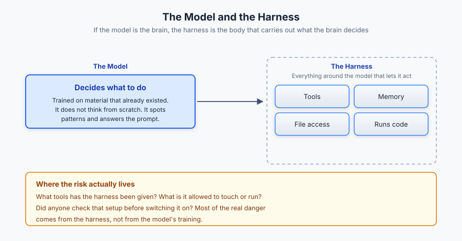
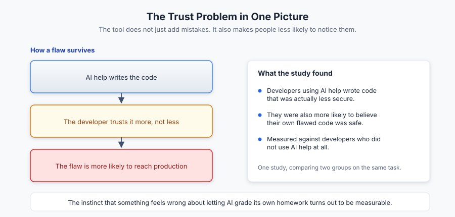
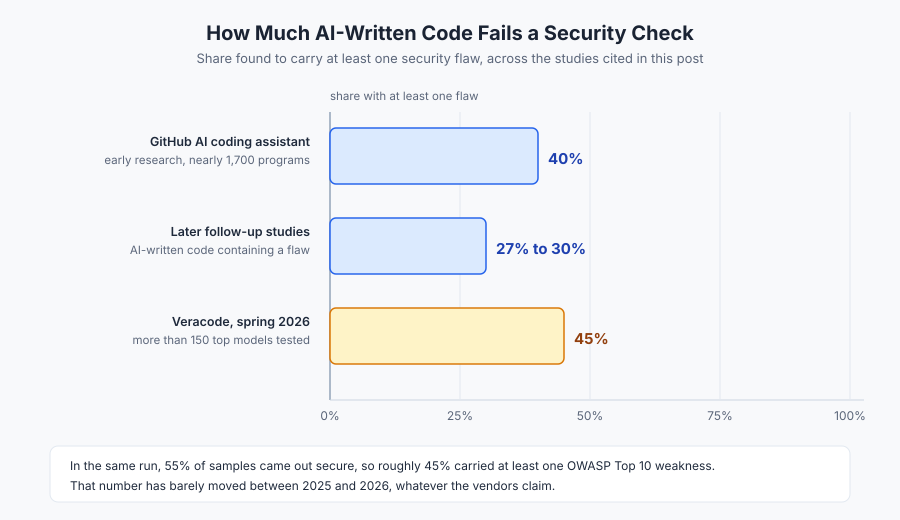
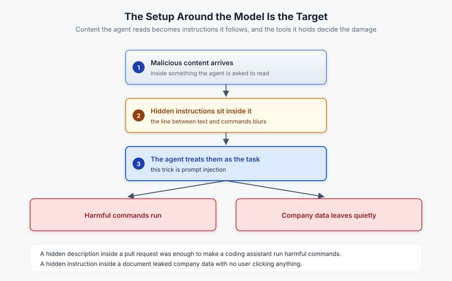
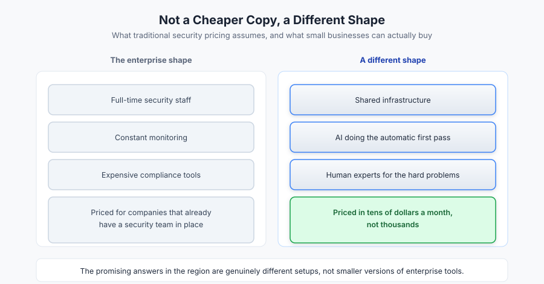
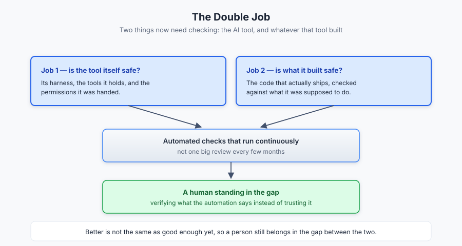

# Who Checks the Checker? AI, Software Security, and Why SecureGraph Exists

AI has changed how developers build and ship products. It has also changed who, or what, gets asked to guard the door. The same kind of tool that made people worried about AI safety in the first place is now the tool being handed the job of keeping everything else safe.

That puts security professionals in an odd position. They now have two jobs instead of one. First, check whether the AI tool itself is safe to use. Second, check whether whatever that tool built is safe. This raises an honest question. If a system writes the product, how much can we really trust it to check its own work?

## Clearing up what an LLM actually is

Before going further, a few terms are worth explaining simply, because a lot of the confusion around this topic comes from loose language.

A large language model, often just called AI, is trained on huge amounts of material that already existed before it. Code, articles, documentation, forum posts, books. It does not think from scratch. It generates answers by spotting patterns in everything it has already seen. It is guided by a prompt, which is simply the instructions you give it. A prompt tells it what kind of answer you want, what rules to follow, and how to get there.

Because different jobs need different things from a model, two extra layers have grown around the raw AI:

An AI agent is an AI model set up to follow a specific process, step by step, toward one goal, while staying inside a set of rules you gave it.

A harness is everything built around the model that lets it actually do things in the real world. Tools, memory, access to files, ability to run code. If the model is the brain, the harness is the body that carries out what the brain decides.

*Figure 1. The model and the harness: the model decides, the harness is what actually touches tools, files and systems, and that is where most of the real danger sits.*

This difference matters for security. Most of the real danger does not come from the model's training. It comes from the harness. What tools has it been given? What is it allowed to touch or run? Did anyone actually check that setup before switching it on?

## The trust problem is not just a feeling, it is measurable

The instinct that something feels wrong about letting AI grade its own homework turns out to be backed by real evidence.

Early research on GitHub's AI coding assistant found that about 40 percent of the code it wrote across nearly 1,700 test programs had a security flaw somewhere in it, with weaker results in languages like C compared to Python. Later studies found somewhat lower but still large numbers, around 27 to 30 percent of AI written code containing a flaw. A wider review that combined 19 separate studies came to a simple conclusion. AI models generally do not write safe code on their own, even when steps are taken to try to fix that.

The problem gets worse when people trust the tool too much. One study compared developers who used AI help against those who did not. The developers using AI wrote code that was actually less secure, and they were more likely to believe their own flawed code was safe. That is the trust problem in a nutshell. The tool does not just add mistakes. It also makes people less likely to notice the mistakes.

*Figure 2. The trust problem in one picture: AI-assisted developers wrote code that was less secure, and were more likely to believe their own flawed code was safe.*

The newest large scale test backs this up. In spring 2026, researchers at Veracode tested more than 150 of the top AI models, including the newest ones from every major company. Across all the tasks they tried, only 55 percent of the code produced came out secure. About 45 percent of the samples had at least one flaw from the well known list of common web app weaknesses (called the OWASP Top 10). That number has barely moved between 2025 and 2026, no matter what the companies making these tools claim.

*Figure 3. What the studies above measured: the share of AI-written code found to carry at least one security flaw, including the 2026 run across more than 150 models.*

A separate study by the Cloud Security Alliance looked at large companies and found that developers using AI shipped code three to four times faster than developers who did not. But those same developers introduced new security problems about ten times faster too, building up a pile of unresolved risk faster than teams could clean it up. Georgia Tech researchers, who track public security bug reports back to the exact code change that caused them, found 35 bugs in March 2026 alone that were traced directly to AI generated code. That is more than all of 2025 combined.

None of this means using AI to help build software is a bad idea. It means the checking part, the verification, cannot simply be handed back to the same tool that built the thing in the first place, without anyone looking closer.

## The tool's own setup has become a target

There is a newer twist here that the simple question of "can AI check its own work" does not fully cover. The harness itself, the setup around the model, has become something attackers go after directly. When an AI agent is connected to your email, your codebase, your browser, or other outside tools, the line between "text the model is reading" and "commands the model should obey" gets blurry.

In one real case, a description hidden inside a pull request (a proposed code change) was enough to trick an AI coding assistant into running harmful commands, rated as a very serious flaw. In another case, a hidden instruction buried inside a document let an AI assistant quietly leak company data with no user even clicking anything. Security researchers now see this trick, called prompt injection, as one of the most common ways these systems get broken into.

*Figure 4. How the setup around the model gets used against it: content the agent reads becomes instructions it follows, and the tools it holds decide the damage.*

This is the part worth keeping in mind. Keeping software secure on an ongoing basis cannot just mean "run the AI scanner more often." It has to include treating everything the AI agent can touch, its tools, its memory, its permissions, as a real weak point, not something added on as an afterthought once the model itself passed a test.

## Closing the gap between how fast attacks happen and how slow we are to notice

The idea of building security checks into every single stage of development, instead of doing one big review every few months, exists for a simple reason. Software now ships faster than people can manually review it. That is really the whole argument for using AI in security checks at all. The time it takes an attacker to find and use a weakness keeps shrinking, while the time it takes most companies to notice they have been hit stays slow. Only automated tools can move at the same speed as the threat.

Some of the better tools already being built in this space treat security review as its own careful process, not a single quick scan. People building AI tools that hunt for security flaws have pointed out that an agent which only reads the finished code and ignores the tests written alongside it is missing useful clues. Tests show what the developers actually expected the system to do. What counts as a valid input, who is trusted, what the code is supposed to assert is true. That context helps tell a real security flaw apart from something that just looks suspicious but is actually fine. Getting that distinction right is exactly where a lot of today's AI security tools still struggle. They often turn a normal design choice or an unlikely edge case into a noisy alert that wastes someone's time. It is also worth noting that a good number of these AI security tools are built and tuned specifically to compete in public bug bounty programs, where companies pay real money for real, well proven flaws and ignore anything vague. That kind of pressure tends to push the tools toward being more careful and precise.

The basic limit here does not change though. A product cannot be more secure than the tools and setup it was built with. If the harness is loose, if the review process is shallow, or if the instructions given to the AI agent are vague, no amount of extra AI power later on will fix a weak foundation. Clear and well written instructions, both to the AI building the product and to the AI reviewing it, are not a nice extra. They are the actual thing that makes any of this work at all.

## The affordability gap makes this worse, not less important

This problem hits hardest where budgets are already thin. Small and medium businesses make up about 95 percent of all registered businesses in Sub Saharan Africa and produce close to half the region's economic output. Yet cybercrime already costs African economies billions of dollars every year, and small businesses get hit harder than big ones. South African small businesses reportedly face far more attacks per business than large firms do, and most Kenyan small businesses report even more incidents while they are in the middle of going digital.

The budget numbers tell the rest of the story. Many African small businesses spend only a small fraction per employee on security compared to large companies, and a large share of them have no dedicated security staff at all. That pushes them toward whatever is cheapest, not whatever actually works.

Traditional security practices, the kind involving full time staff, constant monitoring, and expensive compliance tools, were priced for big companies with dedicated security teams already in place. That pricing, and the assumption that a company already has in house experts, is exactly what keeps it out of reach for most African small businesses. It is telling that some of the more promising answers in the region are not smaller versions of enterprise tools, but genuinely different setups. Shared services where many small businesses split the cost of one monitoring system, priced at tens of dollars a month instead of thousands. Government programs offering free basic security checks to hundreds of small businesses a year. That is the direction AI powered security should be heading in generally. Not a cheaper copy of the enterprise version, but a different shape entirely. Shared infrastructure, automatic first pass checks done by AI, and real human experts saved for the harder problems automation cannot yet solve on its own. All priced for a market that was never going to buy the expensive version anyway, no matter how good it is.

*Figure 5. Traditional security pricing assumes in-house experts; the promising answers in the region are a different shape, not a smaller enterprise tool.*

## This is exactly the gap SecureGraph was built for

Everything above points to the same conclusion. Security cannot stay a slow, once a year checkup done by a handful of expensive experts, and it cannot be handed over blindly to AI either. It has to be something in between. Fast enough to keep up with how quickly products now get built, but still careful enough that a human is genuinely in the loop where it matters.

That is what SecureGraph, built by Phantix Security Solutions, is designed to do. It is an AI powered security platform that covers the whole journey, from the first time you set up your security to the ongoing, everyday work of keeping it that way. Instead of forcing a lean team or a small business to piece together five different tools and a full time expert they cannot afford, SecureGraph brings the key pieces together in one place.

It keeps track of everything a business exposes to the outside world, so nothing gets forgotten or left unwatched. It runs automated security testing, the kind normally done by hiring outside penetration testers, using AI agents that can work continuously instead of once a year. And it helps with the risk and compliance side too, the paperwork and standards a business needs to meet, whether that is a local requirement or a widely recognized one.

In other words, SecureGraph is an attempt to build the thing this whole piece has been arguing for. AI doing the fast, repeatable, first pass work. Continuous checking instead of a once a year audit. And a price and shape built for security professionals and lean teams who were never going to be able to afford the old way of doing this, rather than only for companies that already had a security department.

## Where this leaves the professional

The double job is not going away, and maybe it should not. Using AI to build faster while also using AI to check that work is not a problem that needs solving once and for all. It is a habit that has to be built carefully. Automated checks that treat the AI's tools and setup as a real weak point. People who verify what the automation says instead of trusting it by default. Pricing models cheap enough that the small businesses who need this the most are not left out entirely.

*Figure 6. The double job: the AI tool and the software it builds both need checking, with a human standing in the gap between them.*

The tool that writes the product will keep getting better at checking its own work too. But better is not the same as good enough yet, and everything we have seen so far says a human still needs to be standing right there in the gap between the two. That is the gap platforms like SecureGraph exist to close, and it is worth a serious look if you are trying to keep pace with how fast software ships today without pretending the risk that comes with that speed does not exist.

---

### References
1. Pearce and others, research on the security of GitHub's AI coding assistant (cited in Security Degradation in Iterative AI Code Generation, arXiv 2506.11022)
2. Perry and others, study on AI assisted developers and code security (cited in the same review)
3. Majdinasab, Fu, and others, follow up studies on AI coding tool vulnerability rates (arXiv 2605.05867)
4. Veracode, Spring 2026 GenAI Code Security Update, https://www.veracode.com/blog/spring-2026-genai-code-security/
5. Cloud Security Alliance AI Safety Initiative, Vibe Coding's Security Debt: The AI Generated CVE Surge (2026), https://labs.cloudsecurityalliance.org/research/csa-research-note-ai-generated-code-vulnerability-surge-2026/
6. Georgia Tech School of Cybersecurity and Privacy, Bad Vibes: AI Generated Code is Vulnerable, Researchers Warn (2026), https://news.research.gatech.edu/2026/04/13/bad-vibes-ai-generated-code-vulnerable-researchers-warn
7. Cycode, Top AI Security Vulnerabilities to Watch out for in 2026, https://cycode.com/blog/ai-security-vulnerabilities/
8. Bitsight, 5 Things to Consider Building a Continuous Security Monitoring Strategy, https://www.bitsight.com/blog/5-things-to-consider-building-continuous-security-monitoring-strategy
9. Zeet, Continuous Security glossary, https://docs.zeet.co/glossary/continuous-security/
10. Vanta, What is Continuous Security Monitoring, https://www.vanta.com/resources/what-is-continuous-security-monitoring
11. Tech In Africa, Cybersecurity Challenges for African SMEs, https://www.techinafrica.com/cybersecurity-challenges-for-african-smes/
12. SAP Africa News Center, The Essential Tech Trends for African SMEs (2026), https://news.sap.com/africa/2026/03/the-essential-tech-trends-for-african-smes/
13. Zero Cool (ZeroCool_AI), commentary on test informed AI security review and bounty driven security agents, https://x.com/ZeroCool_AI
