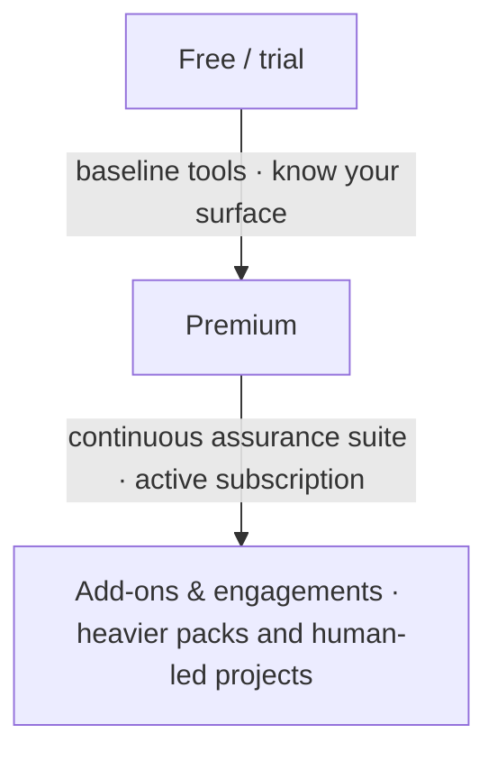

# Pricing & plans

**Headline:** Simple per-company pricing. **No card required for Free.**

Amounts in **NGN** are set in the Platform billing configuration and may include launch discounts. Prefer loading live prices from the product when the website is connected to production billing.

---

## Three layers of access

---

## Free

**Outcome:** Know your surface. Start safely.

Typical inclusions (subject to product config):

- Organization & dual-control foundation
- Asset inventory (fair-use caps)
- Baseline hygiene (e.g. DNS / light network class tools)
- Email alerts
- Data-friendly exports (e.g. JSON / Markdown class formats)
- **GitHub:** public repositories

**Not included:** Full Premium VAPT suite, private-repo analysis, board PDF package, full AI domain agents as premium surfaces (per catalog).

**CTA:** Get started free

---

## Premium

**Outcome:** Continuous assurance for the business.

Typical inclusions (active paid subscription):

- VAPT campaigns & deeper scanners
- Risk prioritization
- Asset intelligence emphasis
- AI assist & domain agents (as entitled)
- Channel alerts (e.g. WhatsApp / Telegram where configured)
- Board-ready report formats (PDF / DOCX class)
- **GitHub:** public **and** private repositories (via GitHub App)

**CTA:** Start Premium / See Platform

---

## Public API — AI Agent plan (only public API SKU)

**Product decision:** The **only payment plan we offer for public API access** is for the **Phantix AI Agent**.

| Included with AI Agent API plan | Not sold as “public API” |
|---------------------------------|---------------------------|
| Programmatic access to domain agents (SOC, GRC, VAPT, TI, Asset, Chief) | Selling the entire Platform API as a standalone developer product |
| Invoke / poll runs, skills, approvals, agent callbacks | Unmetered scan/VAPT/report automation without Platform membership |
| Integrators & automation that need the agent | Free anonymous agent API |

- **Platform Free / Premium** still cover the in-app product (inventory, scans, reports, etc.).
- **Public developers / external integrators** who want API access buy the **AI Agent plan** (see live pricing in-app or sales).
- Agent use may still require an active org and entitlement checks (402 if not entitled).

Landing copy suggestion:

> **API access: AI Agent plan.** Full cybersecurity platform: use Phantix in the product UI under Free or Premium.

---

## Add-ons

For Premium subscribers who need more depth — for example:

- Compliance workbench depth
- Cloud / container / secrets / SAST class packs
- SOC console depth
- Usage-based dynamic mobile
- AI pentest agent (engagement-style add-on; related to but distinct from public AI Agent API packaging)

Request or subscribe in-product; staff may provision design partners.

---

## Engagements

When you need experts or a full assessment program:

- Full external / internal VAPT
- Complex application or mobile dynamic testing
- Guided onboarding and board reporting

**CTA:** Request engagement / Talk to us

---

## Partners & enterprise

Multi-company delivery, branding, and success packaging — contact sales. Same product engines; different commercial terms.

---

## Fair rules

| Rule | Meaning |
|------|---------|
| Free is real | No bait-and-switch on baseline access |
| Premium is continuous | Cancel/expire paths are defined (reminders + short grace may apply) |
| Private GitHub needs Premium | Enforced in product, not only on the website |
| Honest catalog | Planned tools are not sold as finished |

---

## FAQ pricing

**Do you take international cards?**
Billing is built around Paystack (NGN-first). Ask sales for your region.

**Can we get a pilot coupon?**
Design partners may receive time-bound full-access coupons from Phantix staff.

**Is AI charged separately?**
- **In the Platform app:** AI assist may be included with Premium or gated by pack — see live entitlements.
- **Public API:** The only public API payment plan is the **AI Agent plan** (programmatic domain agents), not a full-platform API SKU.
