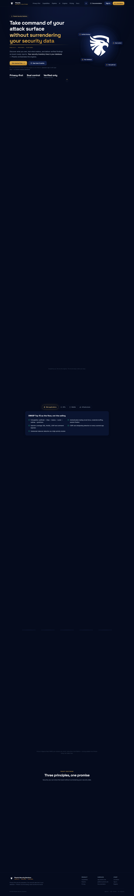
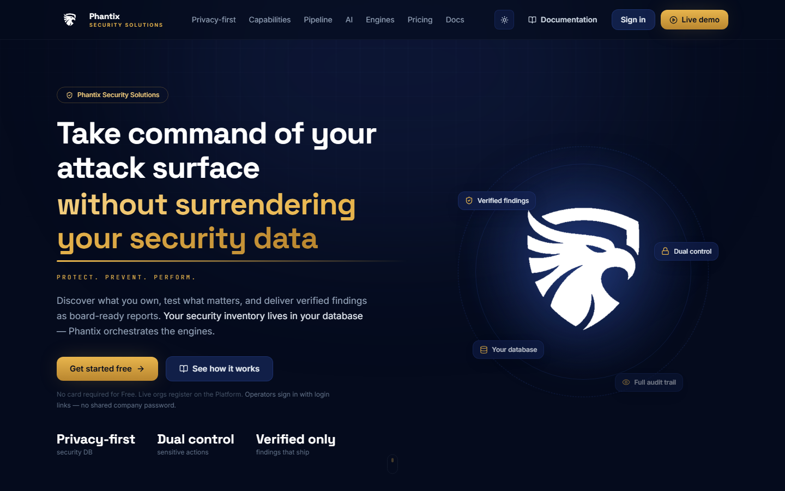

# Phantix Landing Site — User Manual

**URL:** https://phantix.site
**Audience:** Prospective customers, investors, and partners exploring Phantix Security Solutions
**Last updated:** August 2026

---

## 1. Overview

The Phantix landing site is the public marketing front door. It explains the product, pricing, and
capabilities, and routes visitors to the platform (`platform.phantix.site`), the Command Centre demo
(`app.phantix.site`), and the documentation.

---

## 2. Main sections

The page is a single scrollable page organised into clear sections, accessible via the top navigation
and scroll anchors.

### 2.1 Home / Hero

- Introduces the tagline *"Take command of your attack surface without surrendering your security data."*
- Key value props: attack-surface inventory, VAPT, and board-ready reports.
- Primary CTAs: **Register** (platform) and **Launch the live demo** (Command Centre).

### 2.2 How it works

- Explains the phased journey: connect your data → discover assets → scan & verify → assess risk →
  report & govern.
- Emphasises the privacy-first architecture (your security DB, your data).

### 2.3 Capabilities

- Lists the product modules: Asset intelligence, Scans, VAPT, Risk, Compliance/GRC, Reporting, SOC,
  Alerts, AI Agent.

### 2.4 Pricing

- Three tiers: **Free**, **Premium**, and **Enterprise**.
- Live pricing is fetched from the billing endpoint each time the page loads, so prices always reflect
  the current plan.
- Each tier lists its included features; Premium is highlighted.

### 2.5 Footer

- Cross-links to the platform, app, docs, and privacy policy.
- Company/brand footer with supporting links.

---

## 3. Call-to-action flows

| CTA | Destination | What happens |
|-----|-------------|--------------|
| **Get started free / Register** | `platform.phantix.site/register` | Starts company registration |
| **Upgrade to Premium** | `platform.phantix.site/register` | Register then subscribe |
| **Launch the live demo** | `app.phantix.site/login` (demo) | Explores the Command Centre demo tenant |
| **Sign in** | `platform.phantix.site/login` | Existing company sign-in |
| **Talk to us (Enterprise)** | Opens contact path | Enterprise enquiry |

---

## 4. Troubleshooting

- **Pricing shows default numbers:** the live billing endpoint is unreachable; the page falls back to
  static defaults so it still renders. Prices refresh on the next successful load.
- **Links don't open:** confirm you are on the live site (`phantix.site`) and have network access to
  `platform.phantix.site` / `app.phantix.site`.

---

## 5. Related screenshots

- `../screenshots/landing-home.png`
- `../screenshots/landing-how-it-works.png`
- `../screenshots/landing-capabilities.png`
- `../screenshots/landing-pricing.png`
- `../screenshots/landing-footer.png`
