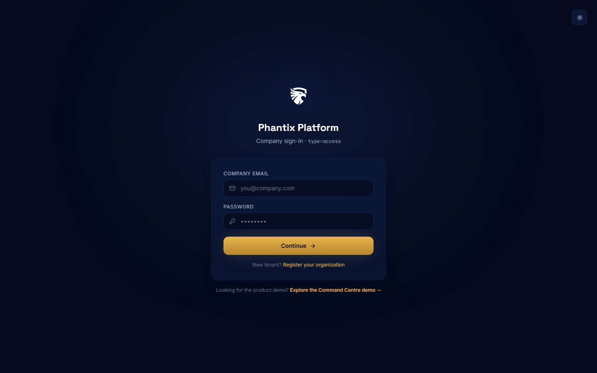

# Phantix Platform — User Manual

**URL:** https://platform.phantix.site
**Audience:** Organization administrators (company owner / security team)
**Last updated:** August 2026

---

## 1. Signing in

1. Go to `platform.phantix.site/login`.
2. Enter your **company email** and **password**, then click **Continue**.
3. An email OTP (6-digit code) is sent to your primary sign-in email. Enter it and click
   **Verify & sign in**.
4. If you don't receive the code, click **Resend code** — a fresh code is emailed.

> **First time?** Register your organization at `platform.phantix.site/register`. After registration
> you'll verify your email via OTP, then complete onboarding (privacy, identity, and connection setup).

---

## 2. Dashboard (Tenant overview)

The dashboard is the tenant home and shows:

- **Getting-started checklist** — organization setup, two dual-control people, initiator/authorizer
  assignment, first operate unlock.
- **Key stats** — org users, connections, companies, service keys.
- **Tenant identity** — tenant ID, slug, creator.
- **Recent activity** — a feed of audit events.
- **Ready for operations** — a link to the Command Centre (`app.phantix.site`), gated on the security
  database being bootstrapped.

---

## 3. Identity & service keys

- View and update **company identity** (legal name, industry, website, address, contacts).
- **Service keys**: create/rotate/revoke the company's `pk_live_*` service key. This key is required
  for application (Command Centre) access.
- **Report branding**: upload or remove the company logo used on report covers and footers.

---

## 4. Users & dual control

- **Create organization users** with a role (admin / security / viewer) and contact details.
- Users are **OTP-only by default** — day-to-day sign-in uses a domain-email OTP via
  `POST /org-users/auth/login`.
- Assign the **initiator** and **authorizer** (dual-control slots). Writes require an operate session
  opened by the initiator or authorizer.
- Generate **application sign-in links** and manage **login-link history**.

---

## 5. Connections (security database)

- Register your dedicated **security data storage** database (PostgreSQL recommended).
- **Test** connectivity and **bootstrap** the Phantix security schema.
- Connection types: `security_data_storage` (full CRUD in the phantix schema) and
  `config_inspection` (roles, privileges, policies).
- Until a security DB is bootstrapped, scans/VAPT/findings are blocked server-side.

---

## 6. Companies (groups)

- For groups of companies: each child company gets its **own service key, users, security database,
  and billing scope** — data stays isolated per company.

---

## 7. Billing

- View the current **subscription** and **payment history**.
- **Subscribe** (monthly or yearly) and **pay** an invoice.
- Redeem a **beta coupon** (Premium + all billable tools) if you have one.
- Billing entitlements gate Premium features; a 402 from the API surfaces an upgrade prompt.

---

## 8. AI governance

- **AI engine** status, default provider, mode (economy / balanced / enterprise), and configured
  providers.
- **Usage this month** — tokens and estimated cost.
- **Phantix Agent** toggle — enable/disable the conversational assistant in the Command Centre
  (dual-control required to change).

---

## 9. Audit trail

- Full audit trail of initiated + authorised actions (who, what, when).
- **Export** the audit trail as CSV.

---

## 10. Alerts

- **Delivery log** of alert events (email / WhatsApp / Telegram).
- **Channels & SMTP** configuration — outbound email relay, WhatsApp (Meta Cloud), Telegram (Bot API),
  recipients, and per-event notification toggles.

---

## 11. Support

- Submit support tickets with subject, priority, and description.
- Track your organization's open tickets.

---

## 12. Tool catalog

- Browse the scanner/tooling catalog (Nmap, Nuclei, Subfinder, Katana, SQLMap, Gowitness, Caido, …).
- **Subscribe** to paid add-ons or **request** a tool; staff review and provision it.

---

## 13. Dual control & operate mode

- Sensitive actions open the **Dual-control overlay**: enter your work email → receive an OTP →
  unlock an **operate session** (active for ~3 minutes of idle, or longer for initiator/authorizer).
- Once unlocked, mutations send the `X-Dual-Control-Session` header and succeed.

---

## 14. Troubleshooting

| Symptom | Resolution |
|---------|------------|
| Login shows "Failed to fetch" | Network/API hiccup — retry. Ensure you're on the live site and the API base is correct. |
| OTP not received | Click **Resend code**; check spam. |
| Scans/VAPT blocked | Bootstrap the security database in **Connections**. |
| Command Centre can't sign in | Create a **service key** in Identity and generate an application **login link** in Users. |
| Dual-control overlay won't unlock | You must be the assigned **initiator or authorizer**. |

---

## 15. Screenshots

- `../screenshots/platform-login.png`
- `../screenshots/platform/dashboard.png`
- `../screenshots/platform/identity.png`
- `../screenshots/platform/users.png`
- `../screenshots/platform/connections.png`
- `../screenshots/platform/companies.png`
- `../screenshots/platform/billing.png`
- `../screenshots/platform/ai-settings.png`
- `../screenshots/platform/audit.png`
- `../screenshots/platform/support.png`
- `../screenshots/platform/tools.png`
- `../screenshots/platform/alerts.png`
