# How to use the Phantix Platform

**URL:** https://platform.phantix.site  
**Audience:** Organization administrators  
**Purpose:** Manage the company tenant (identity, people, security DB, billing). Day-to-day security work happens in the **Command Centre** (`app.phantix.site`).

---

## 1. Sign in

1. Open https://platform.phantix.site/login  
2. Enter **company email** and **password** → **Continue**  

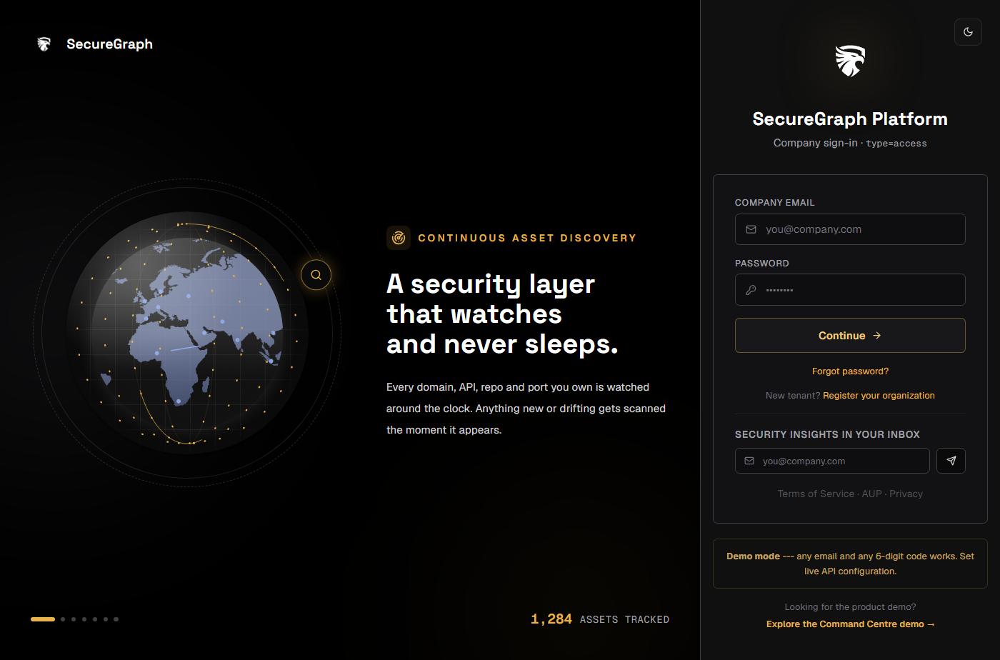

3. Enter the **email OTP** → **Verify & sign in**  
4. You land on the tenant **Dashboard**

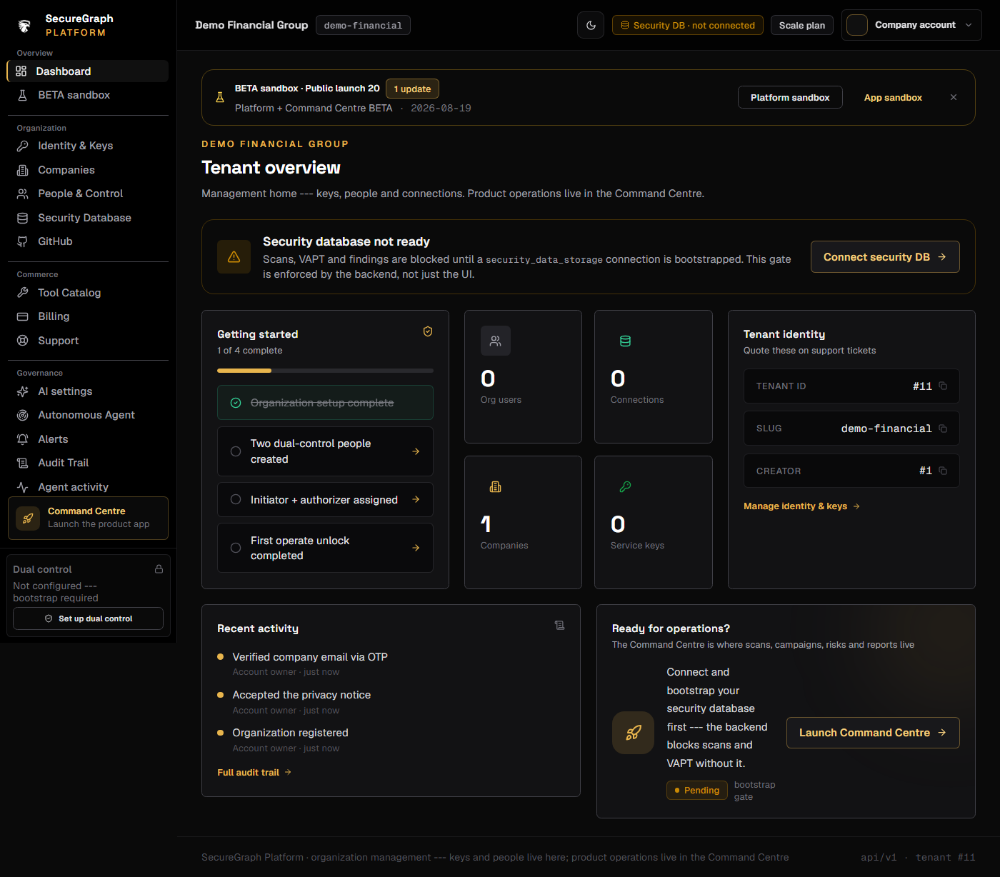

### First-time registration

1. https://platform.phantix.site/register  
2. Create company + verify email  
3. Complete **Setup** (privacy, identity, dual-control people, security DB)

---

## 2. Dashboard checklist

Confirm:

- Organization profile complete  
- At least two people for dual control  
- Initiator + authorizer assigned  
- Security database connected and bootstrapped  
- Then open **Command Centre** for operations  

---

## 3. Identity & service keys

**Nav → Identity & Keys**

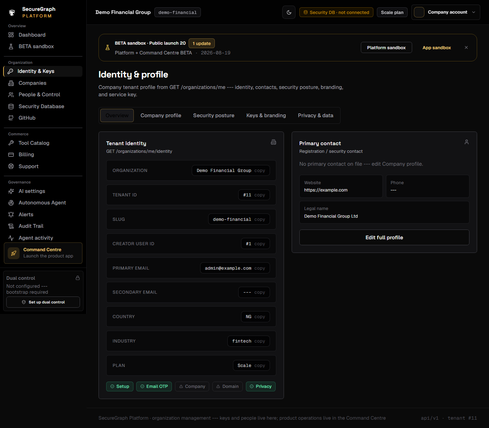

1. Update legal name, industry, website, contacts  
2. Create / rotate **service keys** (`pk_live_*`) used by machine agents and some integrations  
3. Upload **report branding** logo if needed  

---

## 4. People & dual control

**Nav → People & Control**

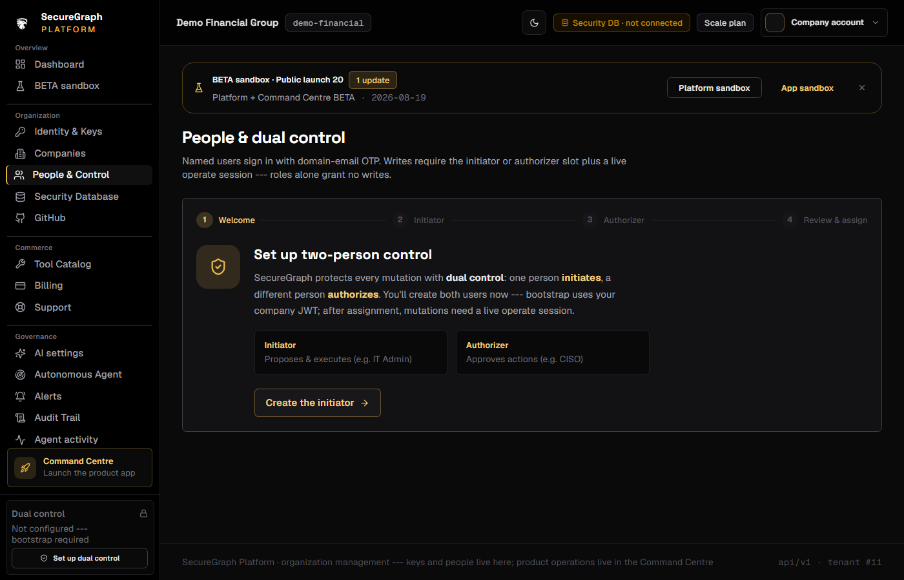

1. **Create users** (name, email, role)  
2. Assign **Initiator** and **Authorizer** (required for operate sessions)  
3. Issue **Command Centre login links** (invite / magic link) for operators  
4. Unlock **Operate** when you need to approve mutations (OTP dual-control flow)  

---

## 5. Security database (Connections)

**Nav → Security Database**

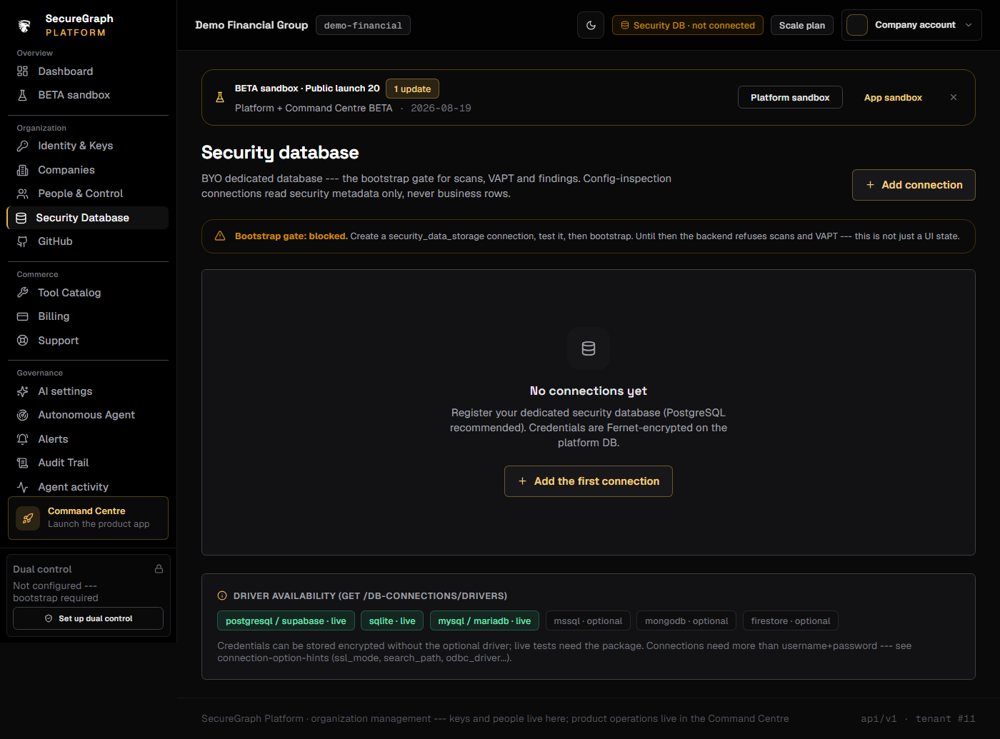

1. Add a PostgreSQL (or supported) database for **security data storage**  
2. **Test** connection  
3. **Bootstrap** Phantix schema  
4. Until bootstrap succeeds, product modules (scans, VAPT, SOC data) stay blocked  

---

## 6. Companies (groups)

**Nav → Companies**

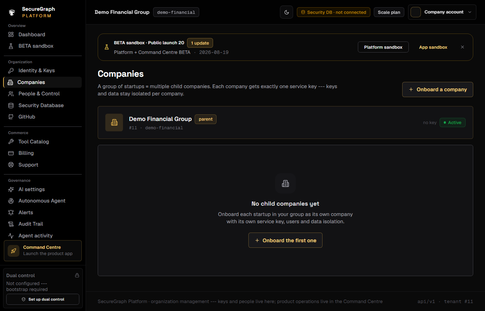

For multi-company groups: each child company keeps its own keys, users, DB, and billing isolation.

---

## 7. GitHub

**Nav → GitHub**

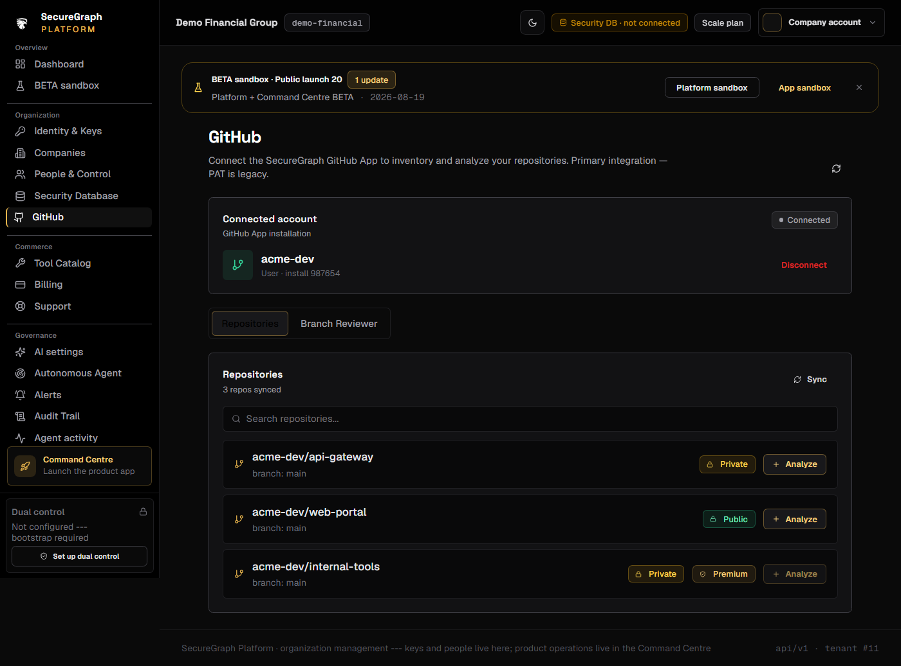

1. Connect GitHub App or PAT  
2. Discover / import repositories as assets (used later in Command Centre)  

---

## 8. Tool catalog & billing

**Nav → Tool Catalog** · **Billing**

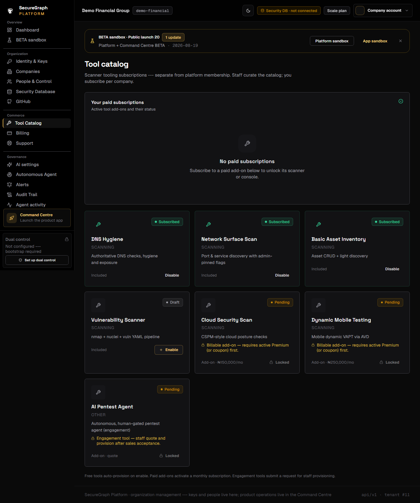

1. Review available tools and provisions  
2. Subscribe (monthly/yearly) or redeem a coupon  
3. Pay invoices via the configured gateway  

---

## 9. AI & Autonomous Agent settings

**Nav → AI settings** · **Autonomous Agent**

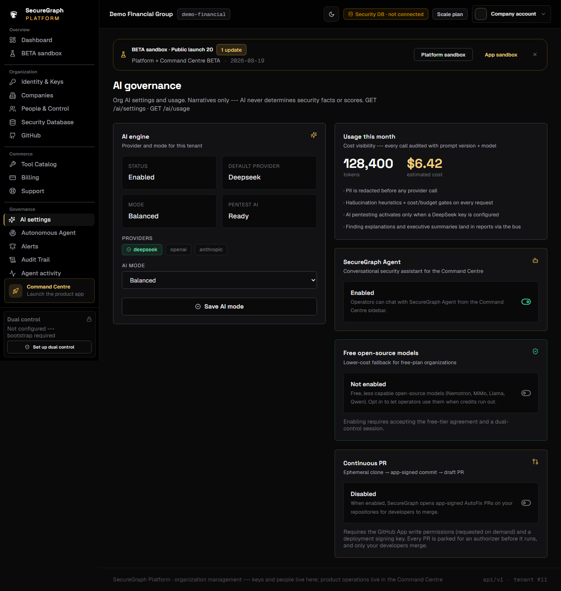

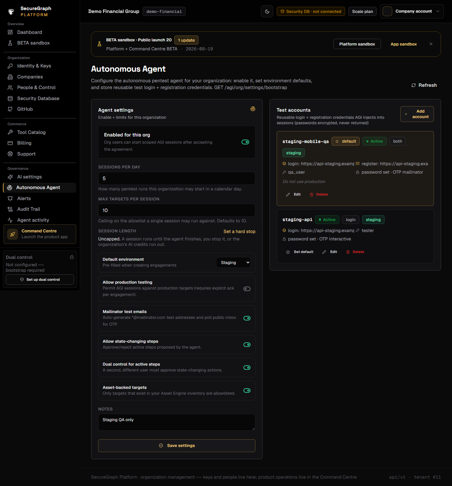

- Configure org AI preferences and AGI access agreement / scopes (product-side).  
- Live AGI **sessions** for staff-run engagements are managed in the **Staff portal**.  

---

## 10. Alerts, support, audit

| Page | Use |
|------|-----|
| **Alerts** | SMTP / channel settings for org notifications |
| **Support** | Open tickets to Phantix |
| **Audit** | Tenant audit trail |

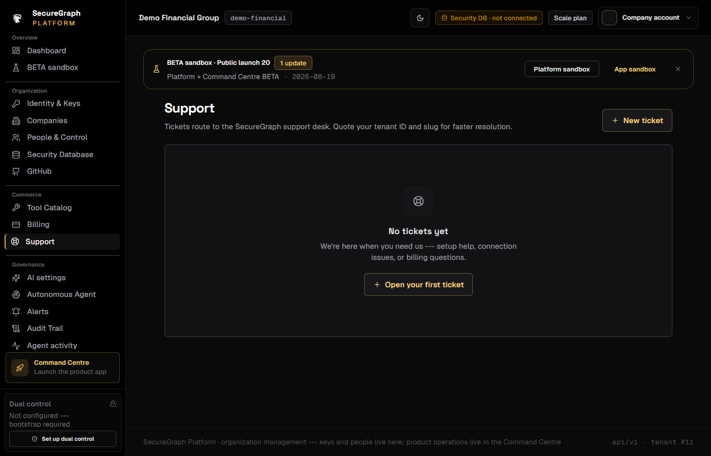

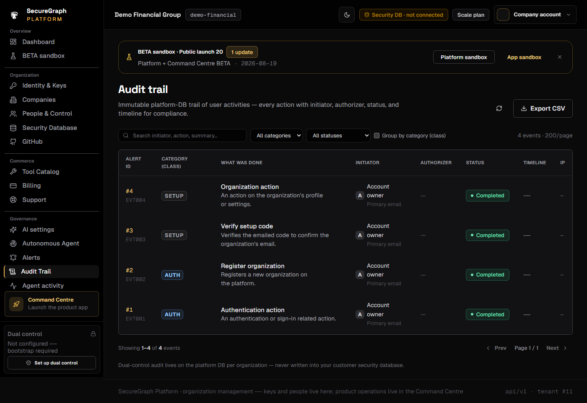

---

## 11. Open Command Centre

From the dashboard **Ready for operations** (or bookmark https://app.phantix.site):

1. Use an **invite / login link** from People, or  
2. Sign in with app credentials (see [Command Centre manual](04-command-centre.md))  

Platform = tenant admin. Command Centre = scans, SOC, risks, reports.

---

## 12. BETA sandbox (enrolled orgs)

If your org is enrolled in the design-partner cohort:

1. Open **BETA sandbox** in the Platform sidebar (only visible when enrolled)  
2. Read staff update notes, acknowledge them, and submit ratings  
3. Also available on Command Centre `/sandbox`  

Applications from the public site are reviewed by staff, not on Platform.

---

## Troubleshooting

| Issue | Fix |
|-------|-----|
| No OTP email | Check spam; use **Resend**; confirm mailbox for lab tenant |
| 402 upgrade required | Subscribe or redeem coupon under Billing |
| 409 security DB | Bootstrap Connections before product modules |
| Dual-control blocked | Unlock Operate as initiator/authorizer |
