# Phantix Staff Portal — User Manual

**URL:** https://staff.phantix.site
**Audience:** Phantix platform staff (support, admins, superadmins)
**Last updated:** August 2026

---

## 1. Signing in

1. Go to `staff.phantix.site/login`.
2. Enter your **staff email** and **password**, then click **Sign In**.
3. If MFA is enabled, complete the emailed code step.

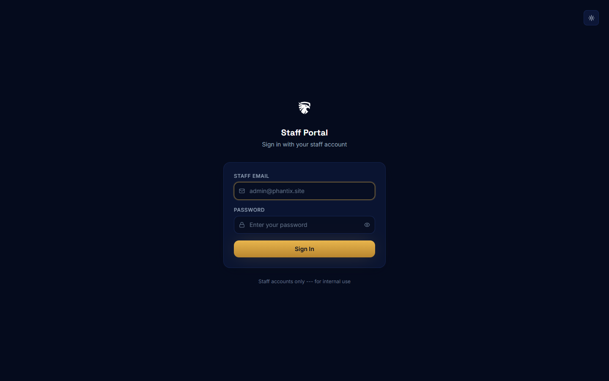

---

## 2. Dashboard

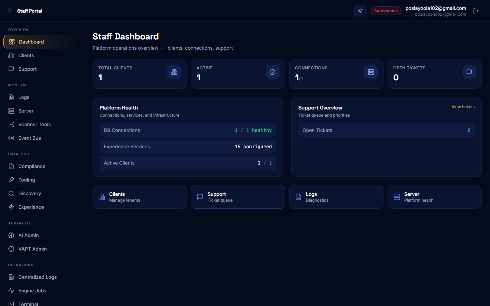

- Platform operations overview: **total/active clients**, **connections**, **open support tickets**,
  and **critical tickets**.
- **Platform health** panel (DB connections, experience services, active clients).
- **Support overview** (tickets by status).
- Quick links to Clients, Support, Logs, and Server.

---

## 3. Clients

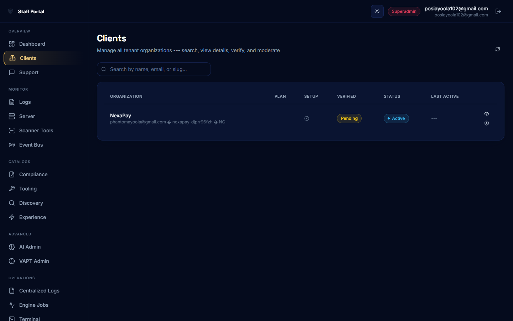

- Search and list all tenant organizations (name, email, slug, country, flags).
- View a client's **detail**, **DB connections**, and tailored **experience**.
- **Approve / reject** company manual verification requests.
- Deactivate clients or set admin notes/tags.

---

## 4. Billing (admin)

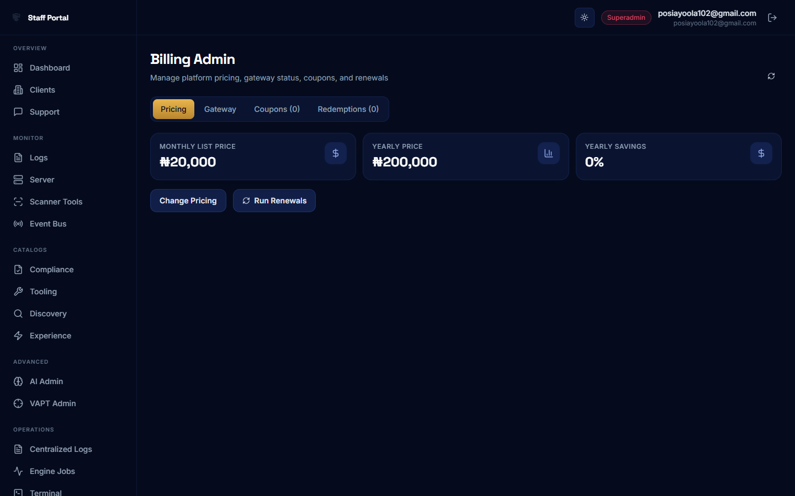

- **Pricing** — set the monthly list price (NGN), yearly price, and first-month discount.
- **Gateway** — Paystack status (keys configured, callback/webhook URL, test mode).
- **Coupons** — generate time-boxed beta codes (max 31 days), list redemptions, deactivate.
- **Run renewals** — trigger subscription renewal invoices.

---

## 5. AI admin

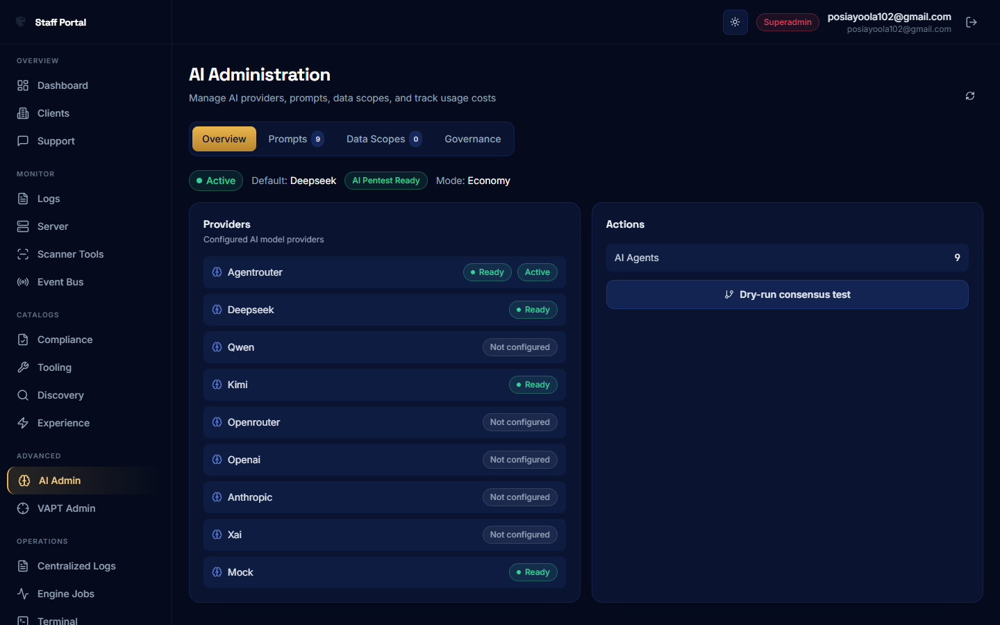

- **Overview** — global AI info: default provider, configured providers, mode, agent counts.
- **Prompts** — view/edit versioned system prompts (`GET/POST/PATCH /admin/ai/prompts`), activate
  versions, and manage **allowed evidence keys** (data scopes).
- **Governance** — cost rollup (`/admin/ai/costs`) and AI audit trail (`/admin/ai/audit-logs`).
- **Activate AI** — seed prompts and enable DeepSeek on all org settings.
- **Consensus test** — dry-run the multi-model coordinator.

---

## 6. VAPT admin

- **Procedures** — create/edit platform-wide VAPT procedure definitions (key, name, category, steps,
  active).
- **Correlation rules** — list built-in correlation rules.
- **Schedules** — create/edit cross-tenant VAPT schedules (procedure, cron, active) and trigger
  run-now / pause / skip-next / delete.

---

## 7. Compliance admin

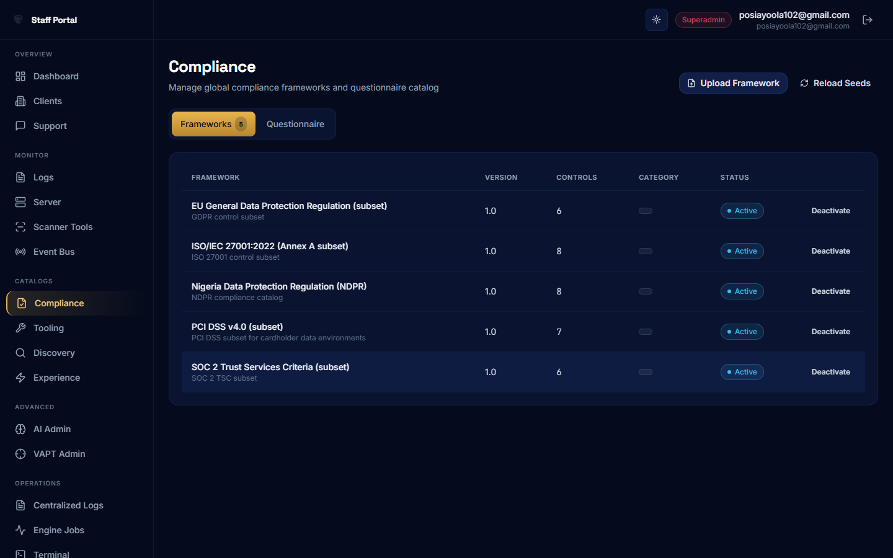

- **Frameworks** — list global compliance frameworks with control/rule counts; activate/deactivate;
  upload a framework JSON (file upload or seed reload).

---

## 8. Tooling

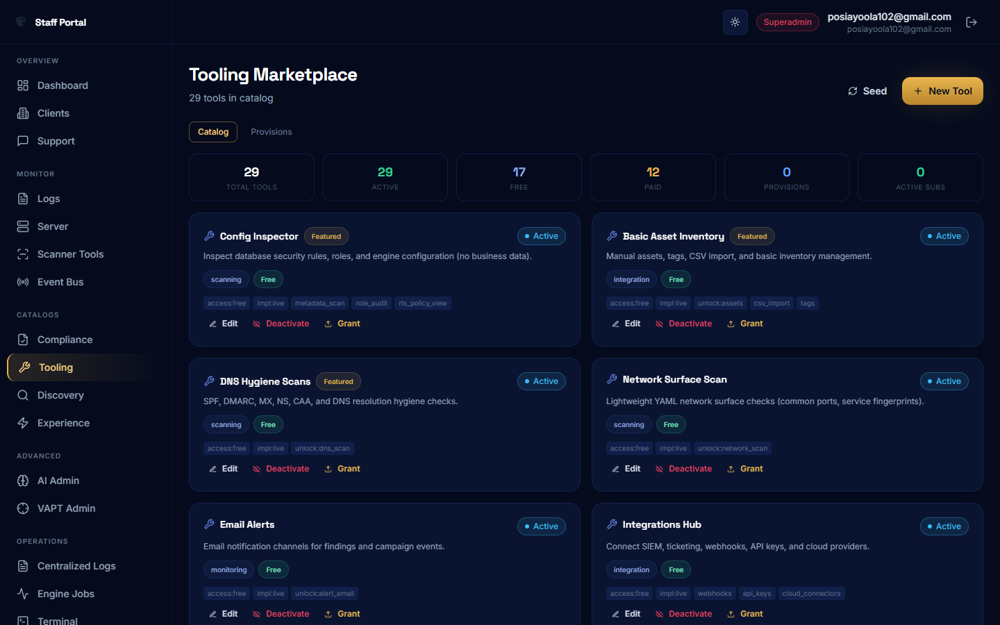

- **Catalog** — create/edit tools (key, name, category, pricing model, price, features, active).
- **Provisions** — grant / suspend tool provisions per organization.
- Seed default tools, and view provisioning stats.

---

## 9. Discovery settings

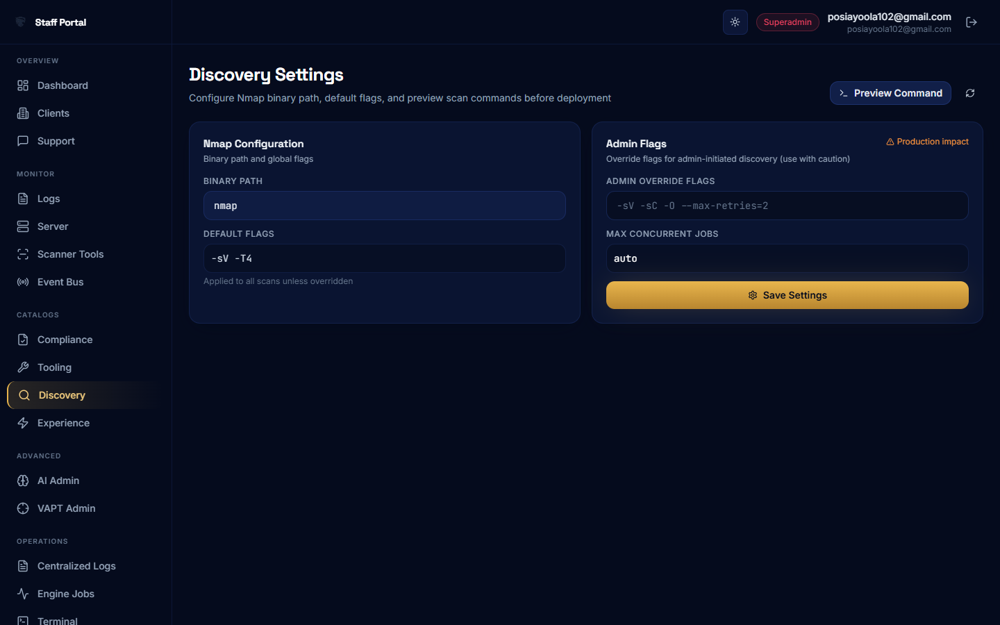

- Configure the **Nmap binary path**, default flags, and admin override flags.
- **Preview** a Nmap command before deployment.

---

## 10. Scanner tools

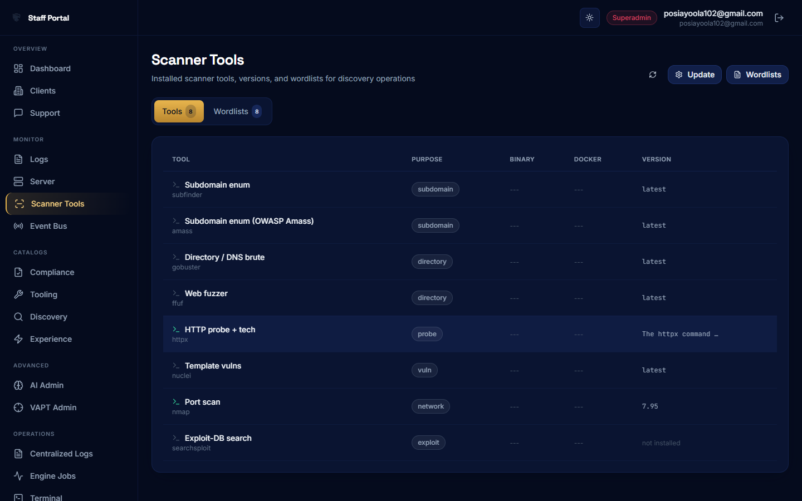

- Installed scanner tool inventory and versions.
- **Update** tool Docker images and **ensure** SecLists wordlists.

---

## 11. Experience services

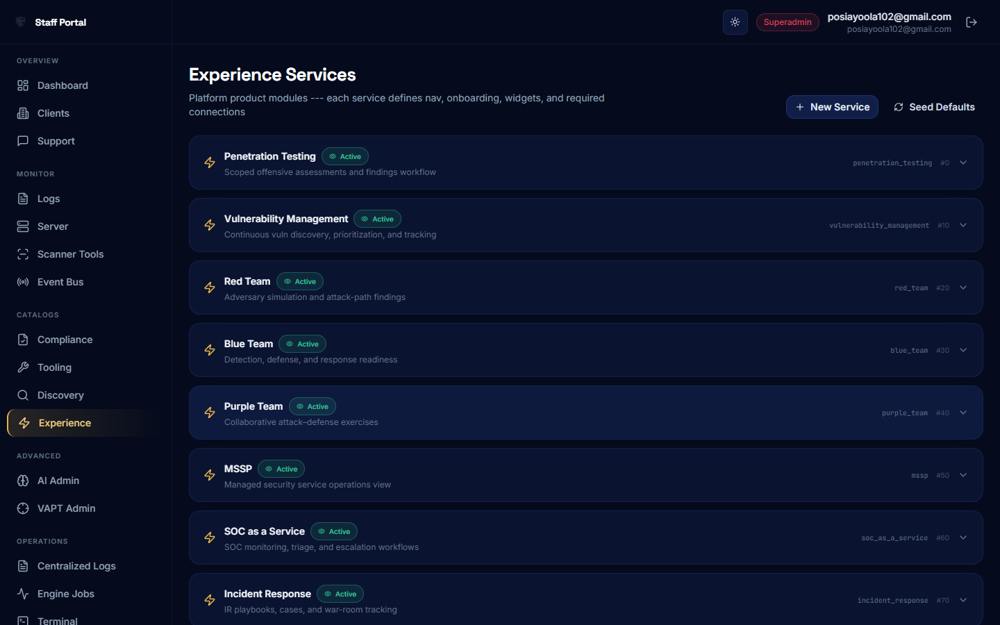

- View/edit per-service **experience configs** (modules, nav, dashboard widgets, onboarding,
  required connections) that shape each client's platform experience.
- Seed defaults.

---

## 12. Server monitoring

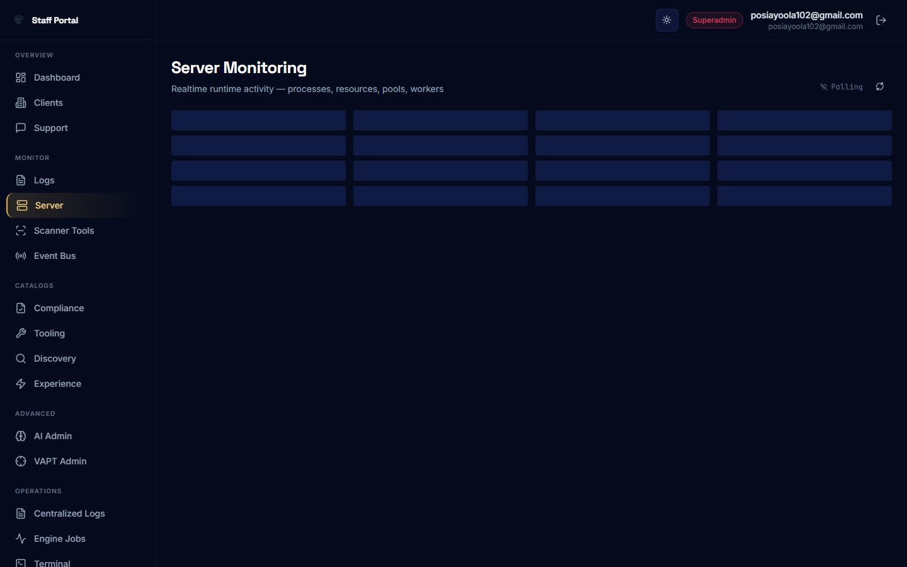

- **Realtime server monitoring**: health score, CPU, memory, DB pool, processes, Celery workers,
  asyncio/GC, tool locks, recommendations.
- **Optimize actions** — `gc_collect`, `dispose_db_pool`, `clear_idle_tool_locks`,
  `process_pending_alerts`, `all`.

---

## 13. Logs

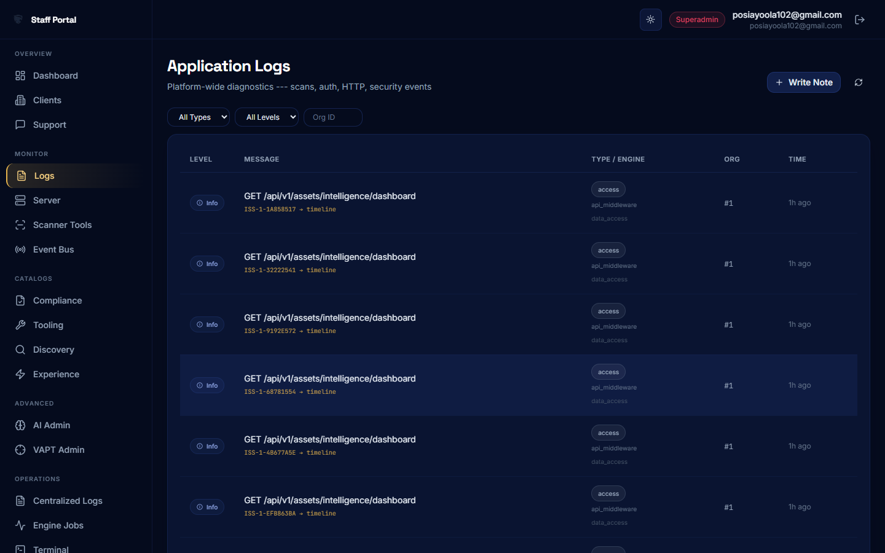

- Filter and browse **application logs** by level, log type, engine, category, and organization.
- Write a diagnostic log note.
- Open an **issue timeline** for a given `issue_id`.

---

## 14. Super logs (all tenants)

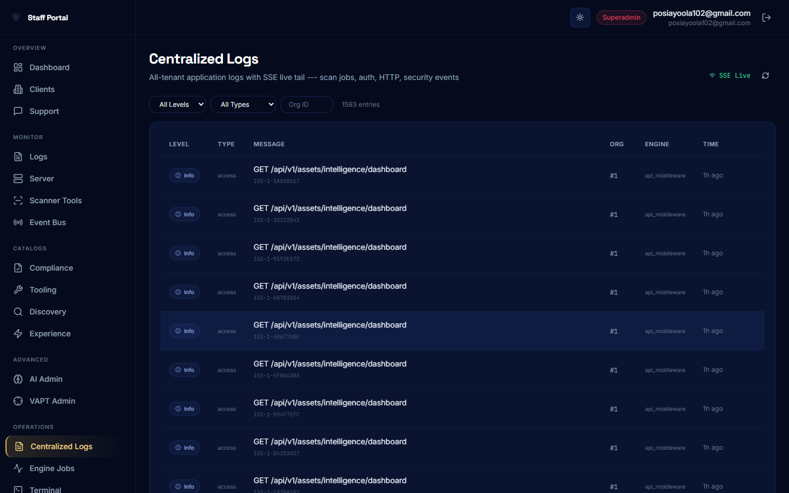

- **Centralized** platform log store across all tenants with SSE **live tail**.
- Filter by level / log type / organization; recent entries stream in realtime.

---

## 15. Engine jobs

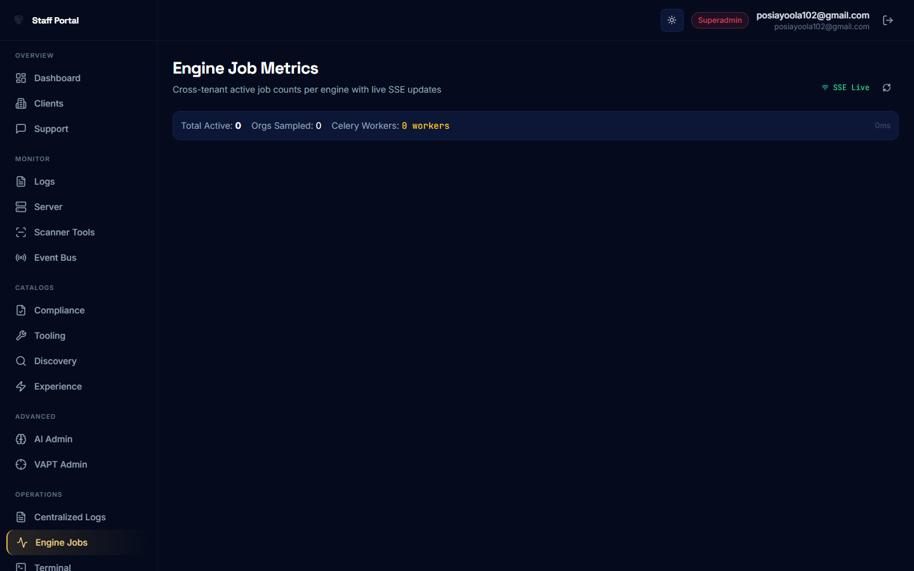

- **Cross-tenant active job counts** per engine (scanner, vapt, reporting, asset, alert, ai) with a
  live SSE feed.
- Celery worker availability and activity history.

---

## 16. Support inbox

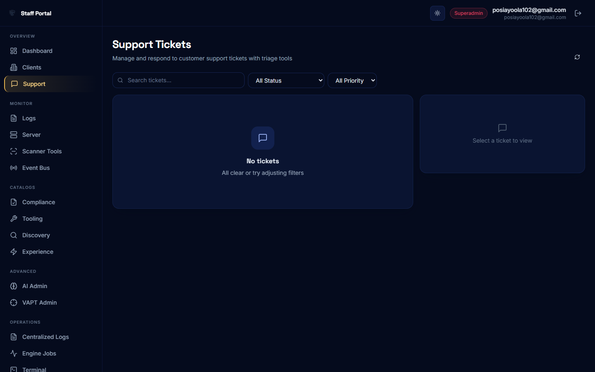

- List all client support tickets; filter by status and priority.
- Open a ticket thread, **reply**, add **internal notes**, and change status/assignment.

---

## 17. Staff users

- List platform staff accounts (superadmin only).
- Create staff users (email, password, role), edit roles, activate/deactivate.

---

## 18. Superadmin terminal

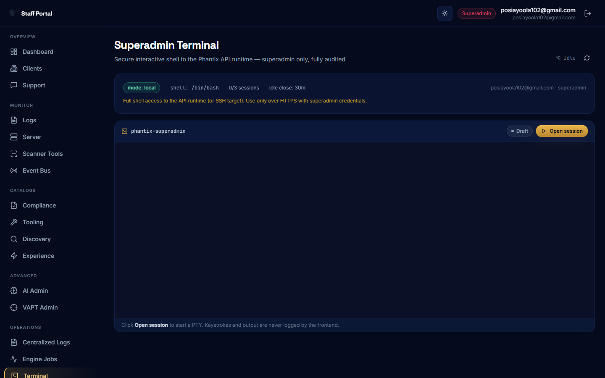

- Superadmin-only capability page describing the WebSocket PTY terminal
  (`wss://…/api/v1/admin/super/terminal/ws`).
- Shows connect guidance; a real terminal requires a staff JWT and the WebSocket endpoint.

---

## 19. Event bus diagnostics

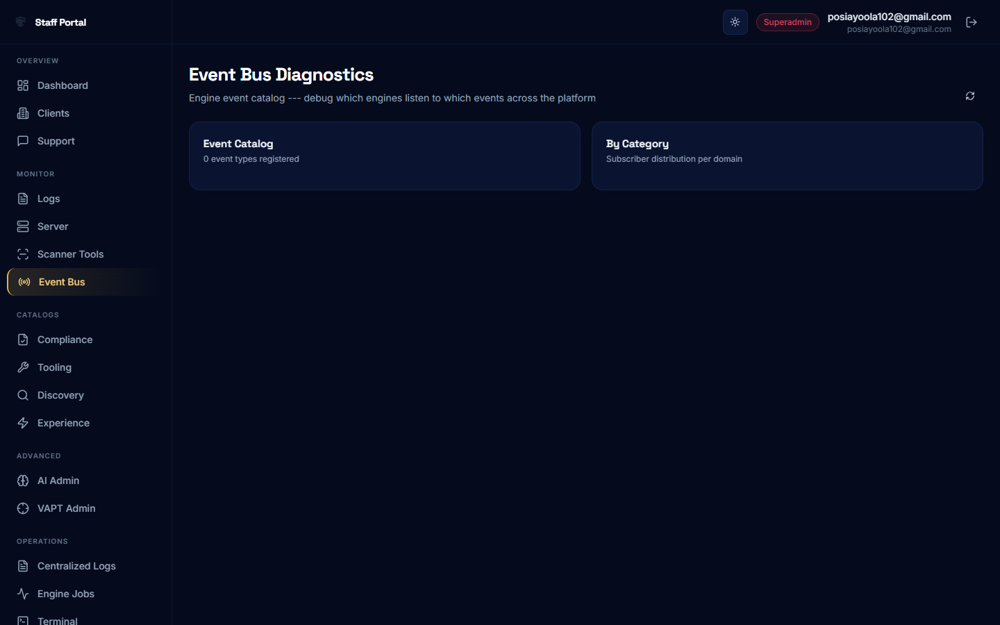

- Browse the approved **Engine Bus event catalog** and which engines subscribe to each event —
  useful for debugging engine integration.

---

## 20. Troubleshooting

| Symptom | Resolution |
|---------|------------|
| Pages show 401 | Staff session expired — sign in again. |
| Client list empty | Confirm you have staff admin role; refresh. |
| SSE "live" not connected | Super logs / engine jobs use SSE — transient reconnects are automatic. |
| Can't create staff users | Requires **superadmin** role. |
| Billing save fails | You need the `admin-billing` permission / admin role. |

---

## 21. Screenshots

- `../screenshots/staff-login.png`
- `../screenshots/staff/dashboard.png`
- `../screenshots/staff/clients.png`
- `../screenshots/staff/billing.png`
- `../screenshots/staff/ai-admin.png`
- `../screenshots/staff/vapt-admin.png`
- `../screenshots/staff/compliance.png`
- `../screenshots/staff/tooling.png`
- `../screenshots/staff/discovery.png`
- `../screenshots/staff/scanner-tools.png`
- `../screenshots/staff/experience.png`
- `../screenshots/staff/server.png`
- `../screenshots/staff/logs.png`
- `../screenshots/staff/super-logs.png`
- `../screenshots/staff/engine-jobs.png`
- `../screenshots/staff/support.png`
- `../screenshots/staff/staff-users.png`
- `../screenshots/staff/terminal.png`
- `../screenshots/staff/bus-diagnostics.png`
