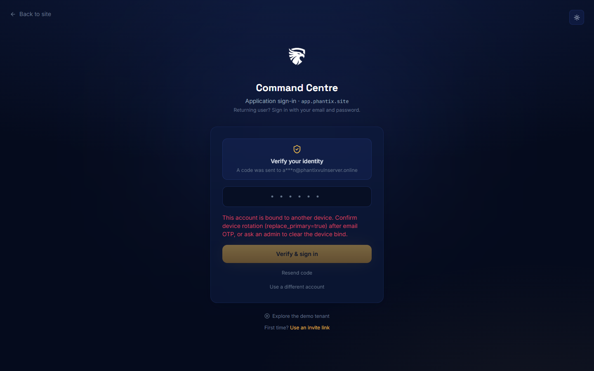
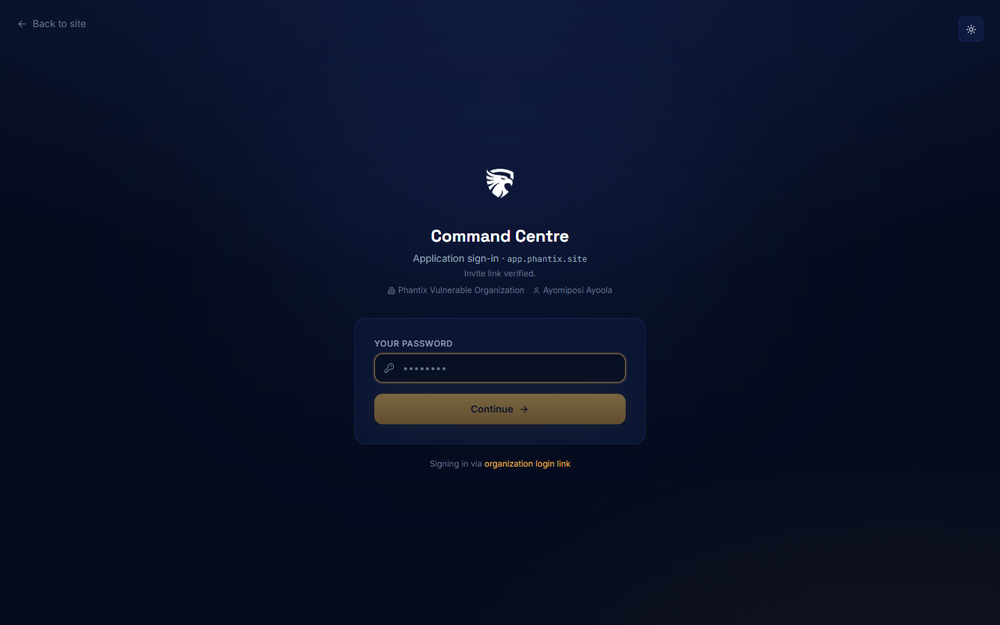
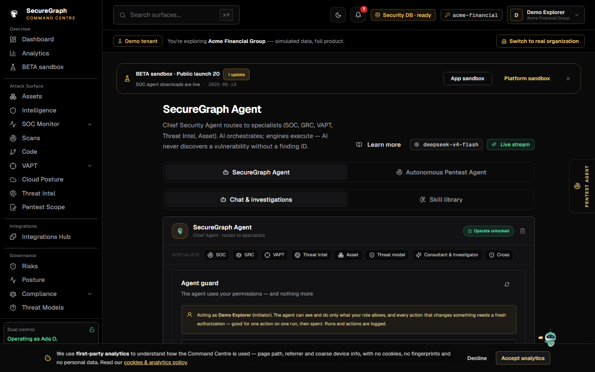
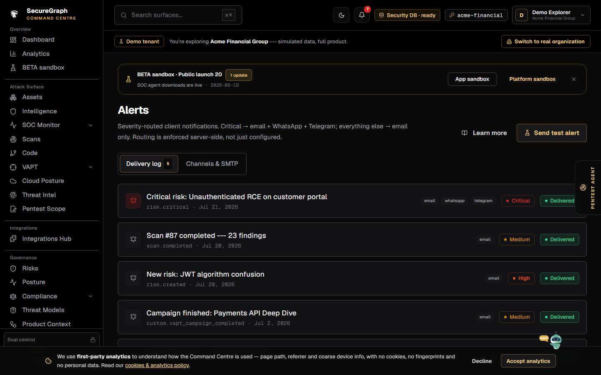
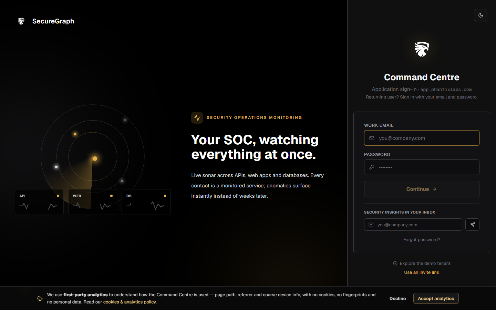
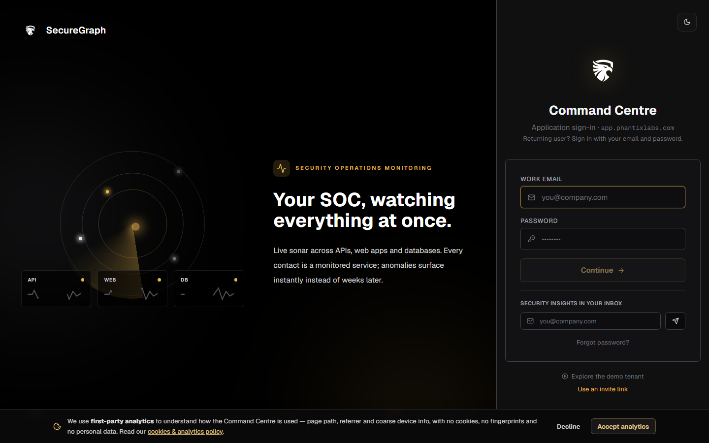
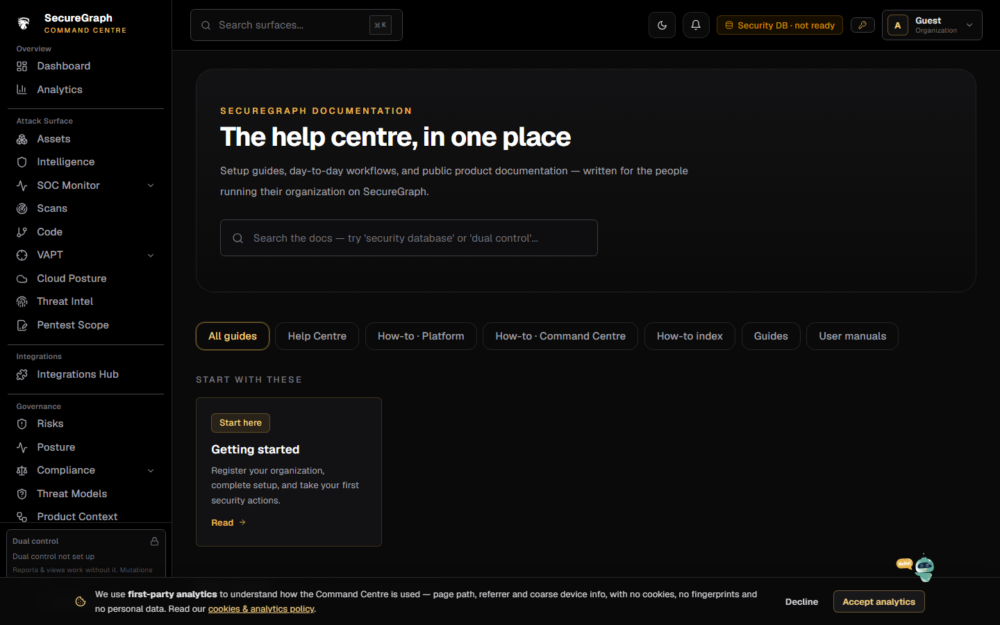

# How to use the Phantix Command Centre

**URL:** https://app.phantixlabs.com  
**Audience:** Security operators (after Platform setup)  
**Purpose:** Day-to-day security work — assets, SOC, scans, VAPT, risks, reports, agent.

---

## Lab credentials (QA / staging)

| Field | Value |
|-------|--------|
| MFA | App login code emailed to the same mailbox |
| Alternate | Platform **login link / invite** from People (no shared company password required for operators) |

Lab org example: **Phantix Vulnerable Organization** (slug from invite links in QA).

---

## 1. Sign in

### Option A — Email + password + OTP

1. Open https://app.phantixlabs.com/login  

2. Enter **work email** and **password** → **Continue**  
3. Enter **application login code** from email  
4. Complete **device confirmation** if prompted (new browser/device)  

### Option B — Invite / login link (preferred for operators)

1. Admin generates a link on **Platform → People**  
2. Open the link → set password (first time) or continue  
3. Complete OTP / device steps  

### Option C — Live demo (no real org)

1. From landing: **Live demo**, or open https://app.phantixlabs.com/demo  
2. Explores a simulated tenant (read-mostly guided demo)  

---

## 2. Dashboard (Command center)

After login you see the **command center** overview.

Typical panels:

- Posture / open findings / open risks / SOC queue / tracker  
- Critical assets, top risks, SOC detections  
- Tracker critical items → Reports tracker  
- Recent reports library  
- Live event rail (SSE) when connected  

**Unlock operate** (header / banner) when you need dual-control mutations (scans, tracker PATCH, etc.).

---

## 3. Assets

**Nav → Assets**

1. Browse inventory (type, criticality, verification)  
2. **Add asset** (domain, host, URL, …) — dual-control may be required  

3. Run discovery / import (GitHub, OpenAPI, APK) as configured  
4. Open asset detail for intelligence and related risks/detections  

### Asset intelligence

**Nav → Intelligence**

- Prioritized assets, posture, graph (when available)  
- Refresh intelligence (operate session if required)  

---

## 4. SOC Monitor

**Nav → SOC Monitor**

1. Review **detection queue** (severity, status)  
2. Open a detection → triage / assign / escalate  
3. Manage **cases** and notes  
4. **Availability** tab: HTTP/TCP checks, incidents, heartbeat **agent downloads** (Linux / macOS / Windows / Python)  
5. Agent auth uses **org API key** (`X-Org-Api-Key`), never a user JWT  

---

## 5. Scans

**Nav → Scans**

1. Unlock operate if needed  
2. **Launch scan** (tools + target filter) — one active job per org  
3. Watch progress; cancel only with operate rights  
4. Open **results** for verified vs unverified findings  

---

## 6. VAPT campaigns

**Nav → VAPT Campaigns**

1. Create campaign (scope, procedure)  
2. Approval gates when required  
3. Start / pause; review correlated findings  
4. Hand off to reports when complete  

---

## 7. Risks

**Nav → Risks**

1. Sort by priority band (P1–P5)  
2. Open risk → propose treatment / assign owner (dual-control)  
3. Export when needed  

---

## 8. Compliance

**Nav → Compliance**

1. Run assessments against frameworks  
2. Review control pass/gap  
3. Attach evidence  

The framework catalog covers international (ISO 27001, SOC 2, PCI-DSS, NIST CSF,
GDPR), application-security (OWASP ASVS / API Top 10, MASVS) and the Nigerian set
(CBN Cybersecurity / AML / Consumer / e-Payments, NIBSS, NDPA / NDPR / NDPC,
Cybercrimes Act, FCCPC, NITDA, SEC Digital Assets, Startup Act). Which frameworks
apply is decided by your **Business profile** - see
[Compliance frameworks](../user-docs/13-compliance-frameworks.md).

| Page | Use it for |
|------|------------|
| **Frameworks** | Applicable frameworks and control coverage |
| **Questionnaire** | The scoping questions, framework-tagged |
| **Gap analysis** | Controls not yet demonstrated, with the mapping that proves it |
| **Business profile** | Sector, jurisdictions, data handled |
| **Evidence connectors** | Continuous evidence collection |

---

## 9. Reports & findings tracker

**Nav → Reports**

### Library tab

1. **Generate report** (type, campaign, formats: md/json/xlsx/pdf/docx/pptx/html)  
2. Dual-control may be required  
3. Download completed formats; open detail for AI narratives / sections  

### Solutions tab

**Report Solutions** lists the report types this organization can generate, read
live from the backend catalog. Each entry shows the audience, when to use it, the
chapters it will contain and the available formats - so a new report type appears
without a frontend release, and the page never advertises a chapter the assembler
does not build.

### Findings tracker tab (`?tab=tracker`)

Living remediation board (not a PDF):

1. Filter by status / severity  
2. Change status: `open` → `in_progress` → `fixed` / `accepted`  
3. `regressed` is set by the backend when a fixed issue returns  
4. Deep links: `/reports?tab=tracker&key=…`  

---

## 10. Phantix Agent

**Nav → Phantix Agent**

1. Chat / skills library (plan-gated)  
2. Operate session required for actions that change org data  
3. Distinct from staff AGI Management console  

The specialist row is the live domain catalog - Chief, Threat model, SOC, GRC,
VAPT, Threat intel, Asset. The agent acts **as you**: it can do only what your role
allows, and every change needs a fresh single-use authorization.

**Agent activity** (`/agent-activity`) is the record: run, domain, action, your
intent, who asked, and whether it ran or was denied - a denial means a control
held. See [Agent activity](../how-to/command-centre/20-agent-activity.md).

**Autonomous Pentest Agent** (right-side drawer) runs governed sessions against
your own assets. First use requires accepting the usage agreement; the agreement
dialog links its guide below the accept button. See
[Autonomous pentest agent](../how-to/command-centre/17-autonomous-pentest.md).

---

## 11. Alerts, audit, people, support

| Page | How to use |
|------|------------|
| **Alerts** | View delivery events; org channel settings may live on Platform |
| **Audit** | Org audit trail |
| **People** | View team (admin create often on Platform) |
| **Authorizations** | Authorizer inbox for pending approvals |
| **Support** | Customer tickets to Phantix |
| **Docs** | In-product manuals |

---

## 12. BETA sandbox (enrolled orgs)

If enrolled:

1. Open **BETA sandbox** in the sidebar (or `/sandbox`)  
2. Read staff deploy notes; **Mark read**  
3. **Rate this build** (score, NPS, area, what broke)  
4. Cross-link to Platform sandbox for org-admin feedback  

Staff push notes from **Staff portal → Sandbox**.

---

## 13. Cloud posture, Code & Posture

| Surface | Nav | What it is |
|---------|-----|------------|
| **Cloud posture** | `/cloud` | Connectors + the five capabilities: pack eligibility, network exposure with first/last-seen, TLS posture, CIS host baselines, execution isolation. [Guide](../how-to/command-centre/18-cloud-security.md) |
| **Threat intel** | `/threat-intel` | IOC lookup, matched and unmatched against your inventory. [Guide](../how-to/command-centre/19-threat-intel.md) |
| **Code** | `/code` | Repositories, PR/branch review, AutoFix, Continuous PR (draft only). [Guide](../how-to/command-centre/21-code-security.md) |
| **Posture** | `/posture` | Continuous loop - reviews due, regressions, accepted-risk age. [Guide](../how-to/command-centre/22-posture.md) |
| **Pentest scope** | `/pentest/external-scope` | External scope and rules of engagement. [Guide](../how-to/command-centre/26-pentest-scope.md) |

---

## 14. Suggested daily path

1. **Dashboard** — posture + open SOC/risks  
2. **SOC** — triage new detections  
3. **Scans / VAPT** — run or review jobs  
4. **Risks** — advance P1 treatments  
5. **Reports / tracker** — update remediation status  
6. **Support** — anything blocked  

---

## Troubleshooting

| Issue | Fix |
|-------|-----|
| Stuck on login / device | Complete device email link; clear old device bind on Platform if needed |
| 409 security DB | Bootstrap security DB on Platform Connections |
| Mutations fail 403 | Unlock dual-control operate session |
| 402 | Billing entitlement — upgrade on Platform |
| Empty tracker | Generate reports / wait for AGI-seeded findings; check `/reports/tracker` |
| Network shows only `/api/v1` | Expected — API is same-origin proxied |
