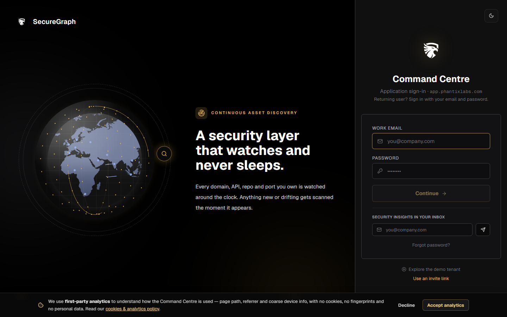
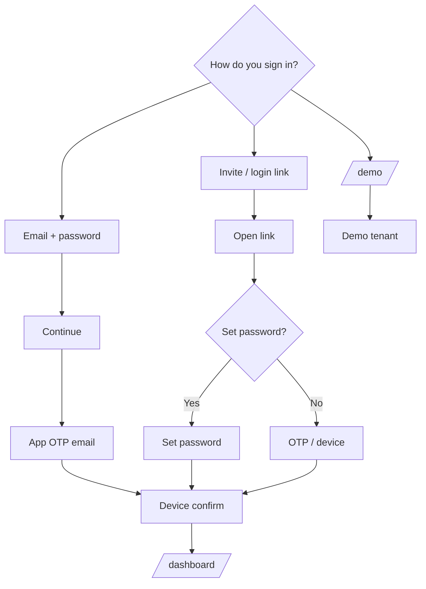
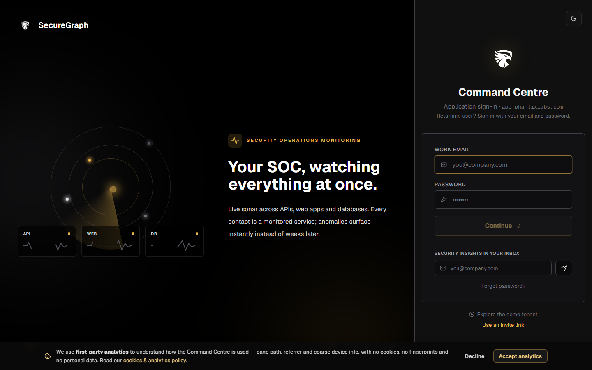

# Command Centre: Sign in

**Where:** https://app.phantixlabs.com/login  

---

## Process flow

---

## A. Email + password

1. Enter email + password → **Continue**.
2. Enter **application login code** from email.
3. Complete **device confirmation** if prompted.

## B. Login link (recommended)

1. Admin issues link on Platform → People.
2. Open link → set password on first use.
3. Complete OTP / device steps.

## C. Demo

Open https://app.phantixlabs.com/demo (no real org data).

---

## After login

You should see the **Command center** dashboard.

