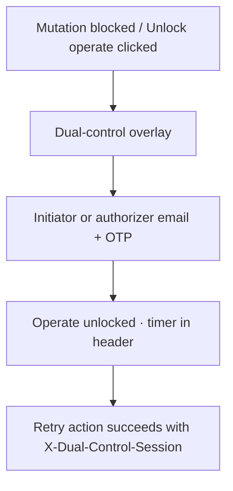

# Command Centre: Unlock operate

**Why:** Scans, campaigns, tracker updates, report generate, many writes need dual-control.

---

## Process flow

---

## Steps

1. Ensure Platform has initiator + authorizer assigned.
2. Click **Unlock operate** (header or prompt).
3. Complete OTP as a dual-control user.
4. Confirm green operate state.
5. Run the protected action.
6. Lock when finished.

**Related (Platform):** [../platform/09-unlock-operate.md](../platform/09-unlock-operate.md)
