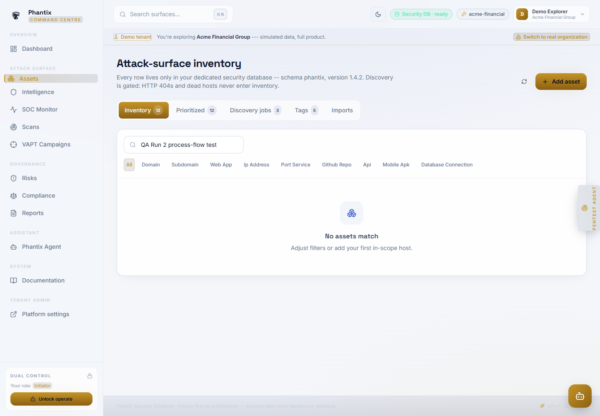
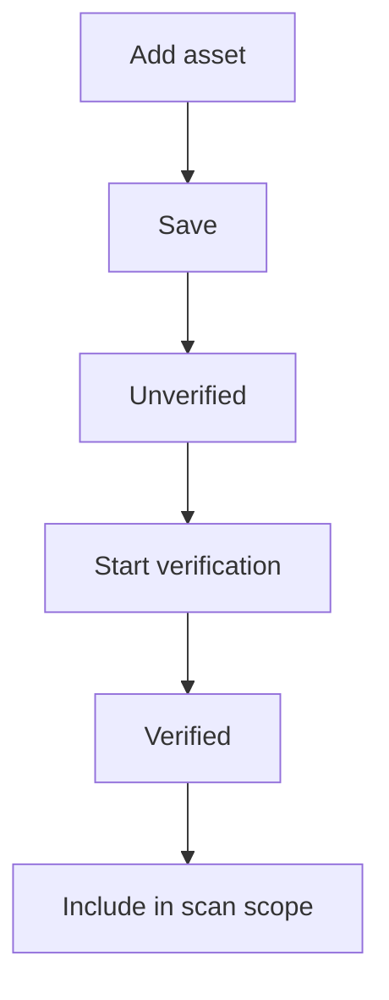
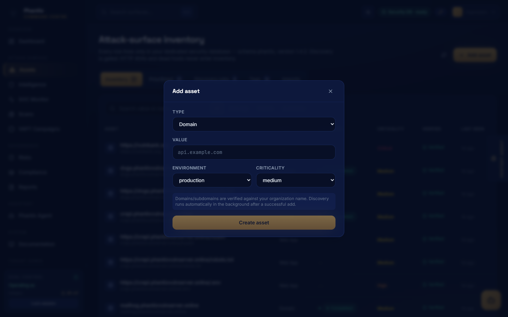
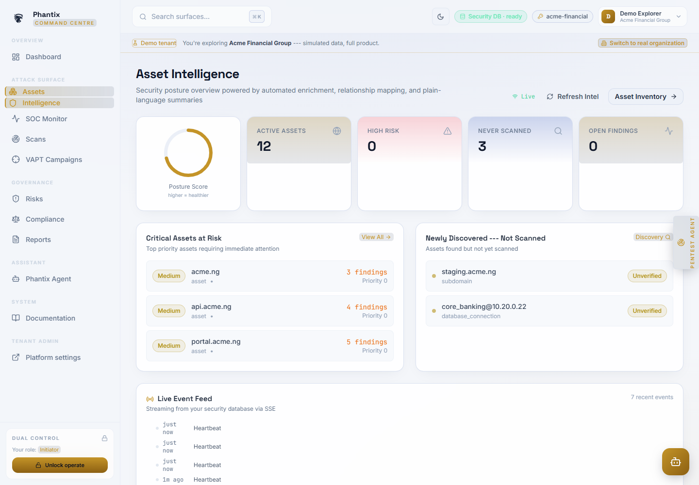

# Command Centre: Add and verify assets

**Where:** **Assets** → `/assets`



---

## Process flow

```text
Assets → Add asset
    │
    ▼
 Choose type (domain, subdomain, IP, URL, repo, …)
 Enter value + criticality + environment
    │
    ▼
 Save (operate if required)
    │
    ▼
 Asset listed (often unverified)
    │
    ▼
 Verify (DNS / HTTP / method offered)
    │
    ▼
 is_verified = true → safer for scans / campaigns
```



---

## Steps

1. **Assets** → **Add asset**.



2. Unlock operate if prompted.
3. Set type, value, name, criticality, environment, tags.
4. Save.
5. Select the asset → **Verify** using the method shown (e.g. DNS TXT, HTTP probe).
6. Confirm verification badge.
7. Optionally open **Intelligence** for risk score / related findings.



---

## Tips

- Prefer verified assets before production-impacting scans.
- Imports (GitHub, OpenAPI, APK) also land here after Platform/GitHub connect.
