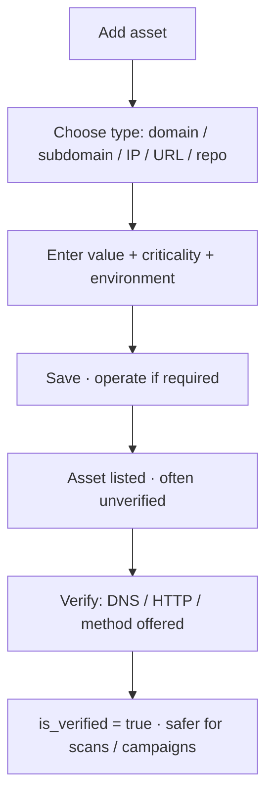

# Command Centre: Add and verify assets

**Where:** **Assets** → `/assets`

---

## Process flow

---

## Steps

1. **Assets** → **Add asset**.

2. Unlock operate if prompted.
3. Set type, value, name, criticality, environment, tags.
4. Save.
5. Select the asset → **Verify** using the method shown (e.g. DNS TXT, HTTP probe).
6. Confirm verification badge.
7. Optionally open **Intelligence** for risk score / related findings.

---

## Tips

- Prefer verified assets before production-impacting scans.
- Imports (GitHub, OpenAPI, APK) also land here after Platform/GitHub connect.
