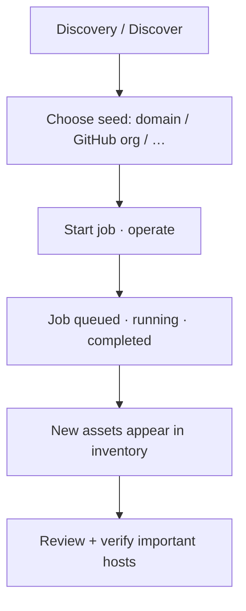

# Command Centre: Run asset discovery

**Where:** **Assets** (discovery actions / jobs)

---

## Process flow

---

## Steps

1. Ensure security DB is ready.
2. Open **Assets**.
3. Start **Discovery** (domain enum, GitHub discover, etc. as available).
4. Unlock operate if required.
5. Watch job status (pending / running / completed / failed).
6. Refresh inventory; triage new unverified assets.
7. Verify critical discoveries before deep scanning.

**Related:** [03-add-and-verify-assets.md](./03-add-and-verify-assets.md)
