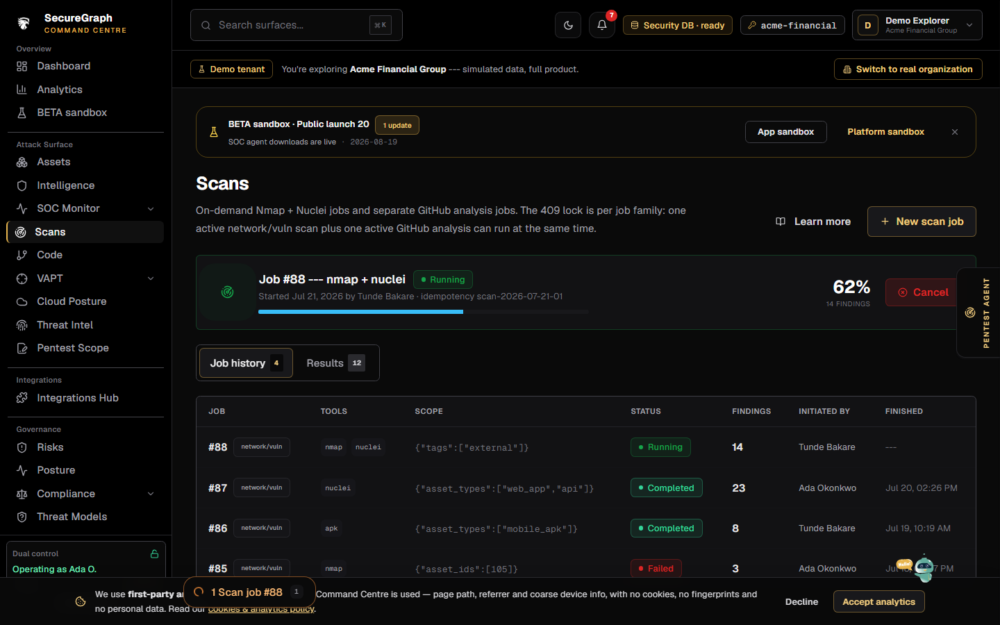
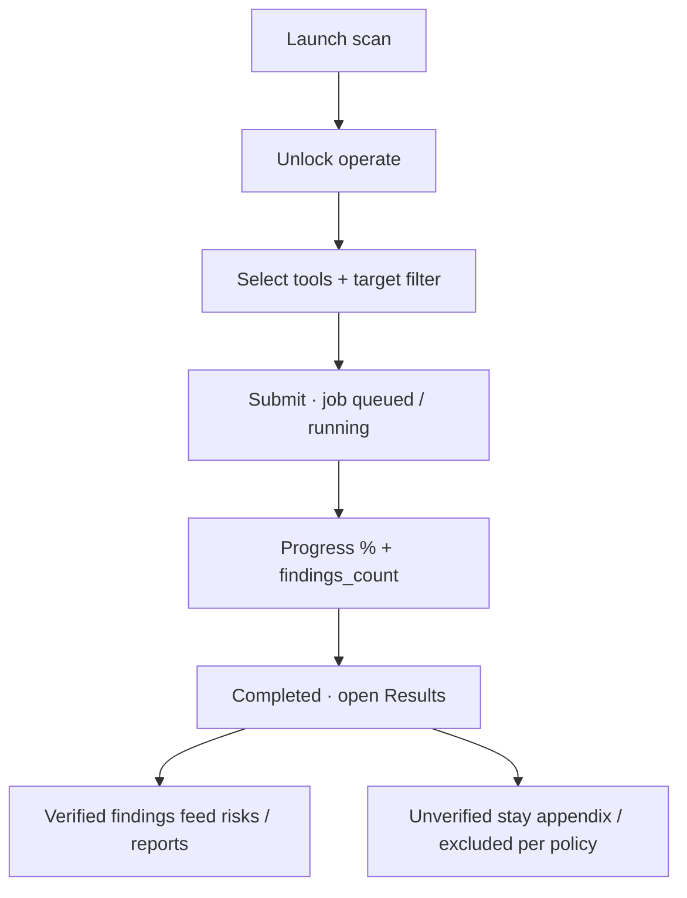

# Command Centre: Launch a scan

**Where:** **Scans** → `/scans`  
**Limit:** One active scan job per organization

---

## Process flow

---

## Steps

1. **Scans** → **Launch scan**.
2. Unlock operate.
3. Choose tools (as licensed) and target filter.
4. Start job.
5. Monitor progress on the scans page.
6. On completion, open **results**; check verification status.
7. Promote important issues via risks / tracker / reports.

---

## Notes

- 409 if another job holds the org lock.
- Cancel requires operate.
- Time budgets / host dedupe may skip already-scanned IPs (see VAPT docs).
