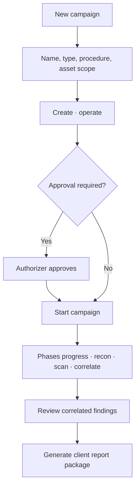

# Command Centre: Run a VAPT campaign

**Where:** **VAPT Campaigns** → `/vapt`

---

## Process flow

---

## Steps

1. **VAPT** → **New campaign**.
2. Unlock operate.
3. Set name, procedure/type, asset scope.
4. Create.
5. If status is pending approval, authorizer completes [14-authorizer-approvals.md](./14-authorizer-approvals.md).
6. **Start** campaign; watch phase + progress.
7. Open findings; verify important items.
8. Generate report when ready ([11-generate-reports.md](./11-generate-reports.md)).

---

## Test process flows

The campaign does not run one generic scan. Each asset's inferred surface picks
a **process flow**, so a web application, a REST API and a GraphQL endpoint are
tested differently — the planner turns off phases an estate cannot exercise
(browser XSS and screenshots on an API-only scope) and turns on the ones it can
(GraphQL introspection, BOLA/IDOR, OpenAPI fuzzing).

- Web application → crawl, XSS, upload, screenshots, auth.
- REST / OpenAPI → route discovery, schema fuzzing, BOLA, JWT.
- GraphQL → introspection, operation discovery, authorization.
- Infrastructure → network/service scan and templates.

The generated plan lists each step's `process_flow`, its vulnerability-type
substeps, and the checks selected against the live catalog. Generate a plan
without starting it via `POST /api/v1/vapt/plan`; execute with modifications via
`POST /api/v1/vapt/plan/execute`.

---

## Retest after remediation

In a finding's detail, **Retest** re-checks whether the issue still holds after a
fix. It runs the deterministic findings check first; only if that can't decide
does the AI engine judge the finding from its stored evidence. The result is one
of **Resolved**, **Still present**, or **Inconclusive**, and the UI shows which
engine decided.

- **Resolved** — the finding is marked a false positive and the human-review flag
  is cleared.
- **Still present** — the finding is flagged for human review.
- **Inconclusive** — no status change; the finding is left for a human.

Retest is a findings-page action — it does not start a new campaign.
