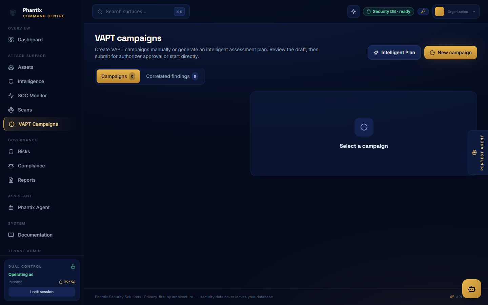
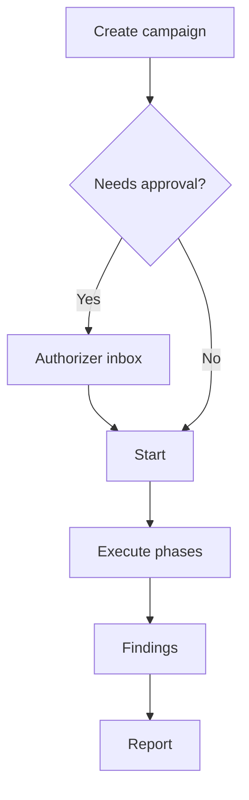

# Command Centre: Run a VAPT campaign

**Where:** **VAPT Campaigns** → `/vapt`



---

## Process flow

```text
VAPT → New campaign
    │
    ▼
 Name, type, procedure, asset scope
    │
    ▼
 Create (operate)
    │
    ▼
 Approval required? → Authorizer approves
    │
    ▼
 Start campaign
    │
    ▼
 Phases progress (recon → scan → correlate → …)
    │
    ▼
 Review correlated findings
    │
    ▼
 Generate client report package
```



---

## Steps

1. **VAPT** → **New campaign**.
2. Unlock operate.
3. Set name, procedure/type, asset scope.
4. Create.
5. If status is pending approval, authorizer completes [14-authorizer-approvals.md](./14-authorizer-approvals.md).
6. **Start** campaign; watch phase + progress.
7. Open findings; verify important items.
8. Generate report when ready ([11-generate-reports.md](./11-generate-reports.md)).
