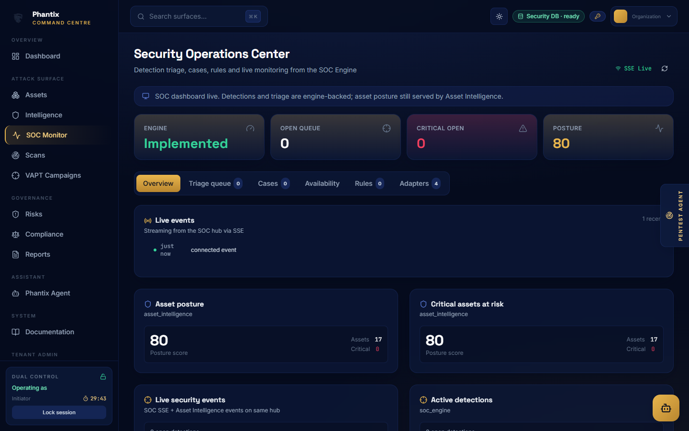
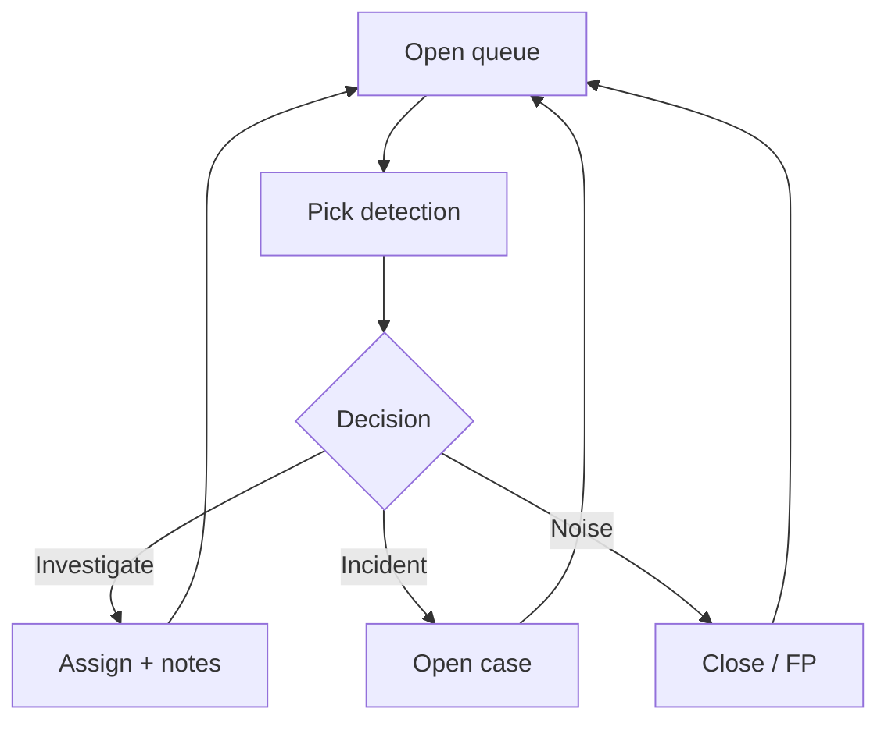

# Command Centre: Triage SOC detections

**Where:** **SOC Monitor** → `/soc`



---

## Process flow

```text
SOC dashboard
    │
    ▼
 Open detections queue (open_only)
    │
    ▼
 Select detection
    │
    ├─► Assign owner
    ├─► Add triage notes / enrich
    ├─► Escalate → case
    ├─► Close / false positive
    └─► Link asset / risk chips
    │
    ▼
 Queue counts update (SSE live if connected)
```



---

## Steps

1. Open **SOC Monitor**.
2. Review **by severity** open counts.
3. Click a detection (or `/soc?id=`).
4. Read evidence / correlation source.
5. **Assign**, add notes, or **escalate to case**.
6. Close when done; avoid leaving criticals unowned.
7. Use cases tab for multi-detection incidents.

**Related:** [08-availability-monitoring.md](./08-availability-monitoring.md)
