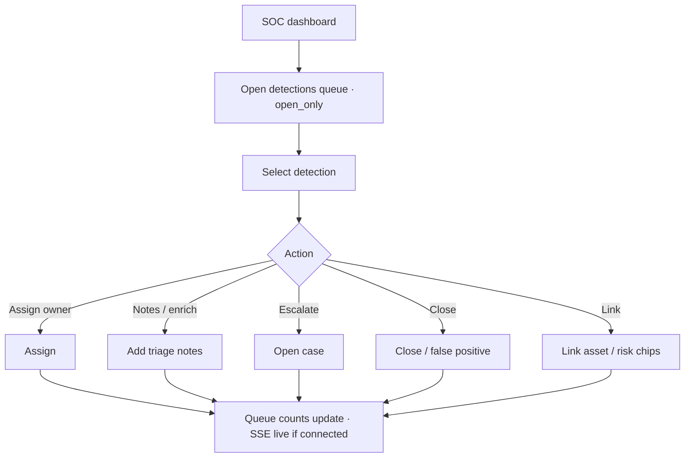

# Command Centre: Triage SOC detections

**Where:** **SOC Monitor** → `/soc`

---

## Process flow

---

## Steps

1. Open **SOC Monitor**.
2. Review **by severity** open counts.
3. Click a detection (or `/soc?id=`).
4. Read evidence / correlation source.
5. **Assign**, add notes, or **escalate to case**.
6. Close when done; avoid leaving criticals unowned.
7. Use cases tab for multi-detection incidents.

**Related:** [08-availability-monitoring.md](./08-availability-monitoring.md)
