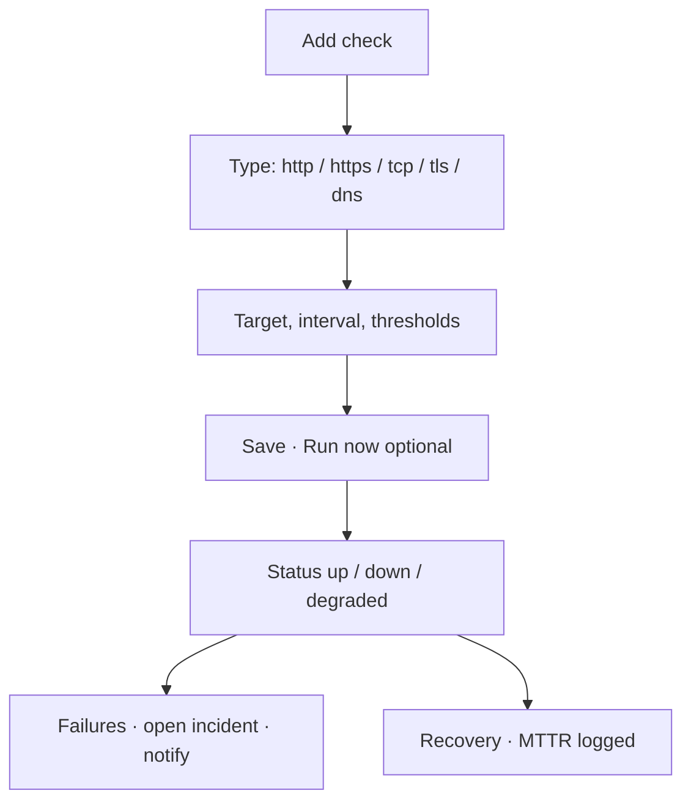
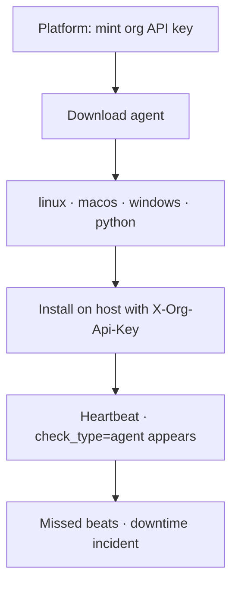

# Command Centre: Availability monitoring & heartbeat agent

**Where:** **SOC Monitor** → Availability  

---

## Process flow — outbound checks

## Process flow — private host agent

---

## Steps — add a check

1. SOC → **Availability**.
2. **Add check** — name, type, target, interval, failure thresholds.
3. Save → **Run now**.
4. Confirm status chip **up**.

## Steps — install agent

1. Open **Download heartbeat agent**.
2. Download OS package; note sha256.
3. Install per commands accordion / walkthrough.
4. Use **org service key**, never user JWT.
5. Confirm new check `agent://hostname` is **up**.

---

## Dual-control

Availability CRUD is not dual-control in v0.2 (per product docs); downloads are reads.
