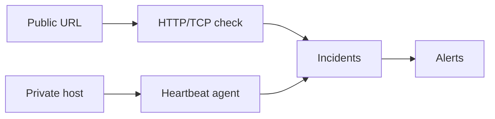

# Command Centre: Availability monitoring & heartbeat agent

**Where:** **SOC Monitor** → Availability  

---

## Process flow — outbound checks

```text
Availability → Add check
    │
    ▼
 Type: http/https/tcp/tls/dns
 Target, interval, thresholds
    │
    ▼
 Save → Run now (optional)
    │
    ▼
 Status up/down/degraded
    │
    ▼
 Failures → open incident → notify
 Recovery → MTTR logged
```

## Process flow — private host agent

```text
Platform: mint org API key
    │
    ▼
 SOC → Availability → Download agent
 linux | macos | windows | python
    │
    ▼
 Install on host with X-Org-Api-Key
    │
    ▼
 Heartbeat → check_type=agent appears
    │
    ▼
 Missed beats → downtime incident
```



---

## Steps — add a check

1. SOC → **Availability**.
2. **Add check** — name, type, target, interval, failure thresholds.
3. Save → **Run now**.
4. Confirm status chip **up**.

## Steps — install agent

1. Open **Download heartbeat agent**.
2. Download OS package; note sha256.
3. Install per commands accordion / walkthrough.
4. Use **org service key**, never user JWT.
5. Confirm new check `agent://hostname` is **up**.

---

## Dual-control

Availability CRUD is not dual-control in v0.2 (per product docs); downloads are reads.
