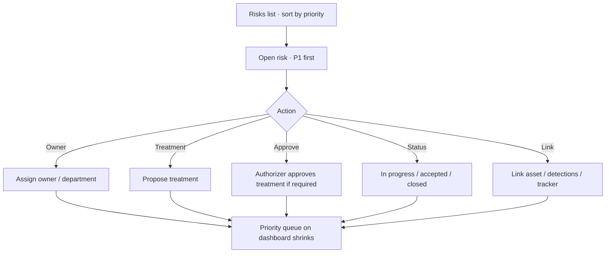

# Command Centre: Manage risks

**Where:** **Risks** → `/risks`

---

## Process flow

---

## Steps

1. Open **Risks**; sort by priority score / band.
2. Click a risk (or `/risks?id=`).
3. Unlock operate for writes.
4. Assign owner.
5. Propose treatment with residual notes.
6. Track status until closed or formally accepted.
7. Export risk list if needed for GRC.
