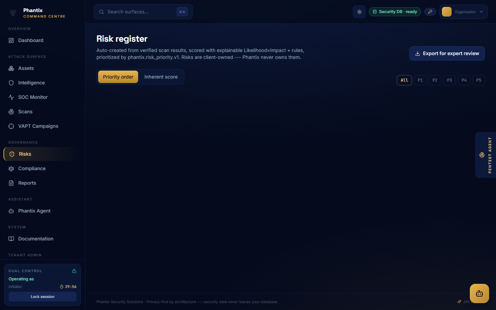
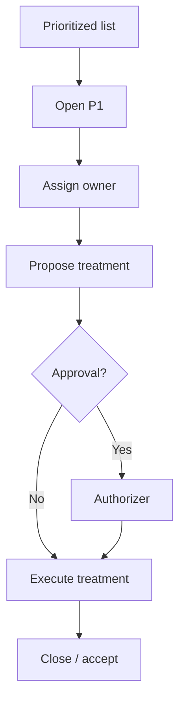

# Command Centre: Manage risks

**Where:** **Risks** → `/risks`



---

## Process flow

```text
Risks list (sort by priority)
    │
    ▼
 Open risk (P1 first)
    │
    ├─► Assign owner / department
    ├─► Propose treatment
    ├─► Authorizer approves treatment (if required)
    ├─► Mark in progress / accepted / closed
    └─► Link asset / detections / tracker
    │
    ▼
 Priority queue on dashboard shrinks
```



---

## Steps

1. Open **Risks**; sort by priority score / band.
2. Click a risk (or `/risks?id=`).
3. Unlock operate for writes.
4. Assign owner.
5. Propose treatment with residual notes.
6. Track status until closed or formally accepted.
7. Export risk list if needed for GRC.
