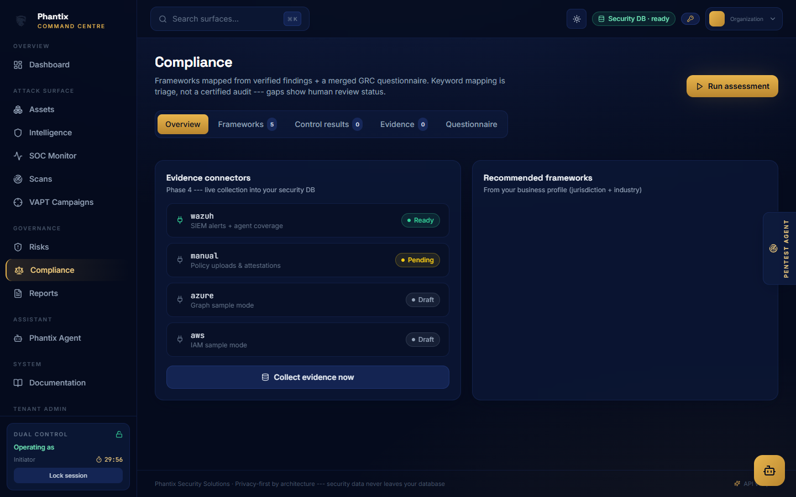

# Command Centre: Run a compliance assessment

**Where:** **Compliance** → `/compliance`



---

## Process flow

```text
Compliance
    │
    ▼
 Select framework (ISO, NDPR, …)
    │
    ▼
 Run assessment (operate)
    │
    ▼
 Score + controls pass/gap/unknown
    │
    ▼
 Attach evidence (connectors / upload)
    │
    ▼
 Re-run after fixes
```

---

## Steps

1. Open **Compliance**.
2. Pick a framework.
3. Unlock operate → **Run assessment**.
4. Review control results (pass / gap / unknown).
5. Collect or upload evidence for gaps.
6. Track score over time on the dashboard compliance card.
