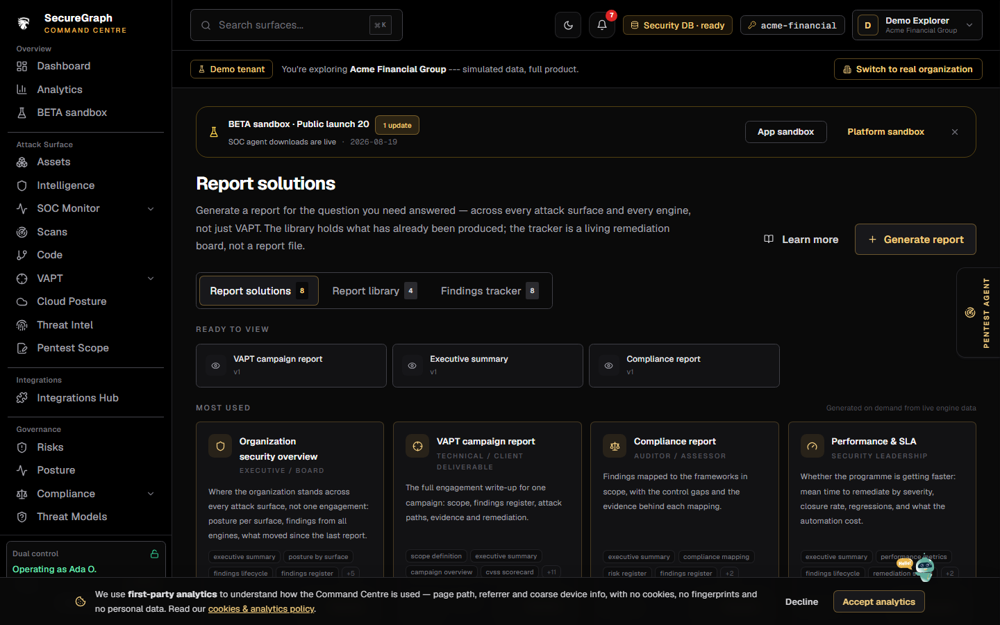
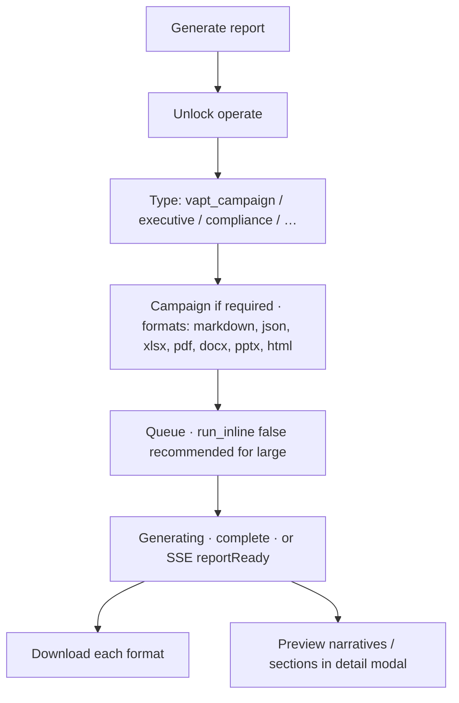

# Command Centre: Generate reports

**Where:** **Reports** → library tab `/reports`

---

## Process flow

---

## Steps

1. **Reports** → **Generate report**.
2. Unlock operate.
3. Choose type and campaign (or AGI source if prompted).
4. Select formats (include **pptx** and **html** when needed; pdf may also produce pptx).
5. Prefer **run_inline = false** for large jobs.
6. Wait until status **complete**.
7. Download artifacts; open detail for executive AI narratives.
8. Remember: **verified-only** policy — candidates may be appendix-only.

**Not the tracker:** living remediation is [12-findings-tracker.md](./12-findings-tracker.md).
