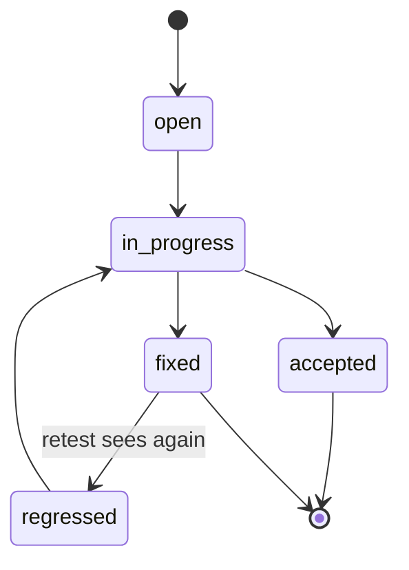

# Command Centre: Findings tracker

**Where:** **Reports** → **Findings tracker** tab (`/reports?tab=tracker`)  
**What:** Living remediation board — **not** a generated file.

---

## Process flow

```text
Open tracker tab
    │
    ▼
 Board + summary chips (open / in_progress / fixed / …)
    │
    ▼
 Filter / search
    │
    ▼
 Change status (operate + dual-control when configured)
    │
    open → in_progress → fixed
              ↘ accepted
    regressed ← backend when fixed issue returns
    │
    ▼
 Optional: open drawer / deep link ?key=
    │
    ▼
 Cross-link asset / risk / SOC / report file
```



---

## Steps

1. **Reports** → **Findings tracker**.
2. Review summary counts.
3. Unlock operate to change status.
4. Set owner via API fields if exposed; keep statuses in the allowed set only:
   - `open` · `in_progress` · `fixed` · `accepted` · `retest_failed` · `regressed`
5. Never render PDF/HTML inside this tab.
6. Use library tab for file downloads.

---

## Statuses (do not invent others)

| Status | Meaning |
|--------|---------|
| open | Not started |
| in_progress | Being fixed |
| fixed | Remediated |
| accepted | Risk accepted |
| retest_failed | Fix did not hold |
| regressed | Was fixed; seen again |
