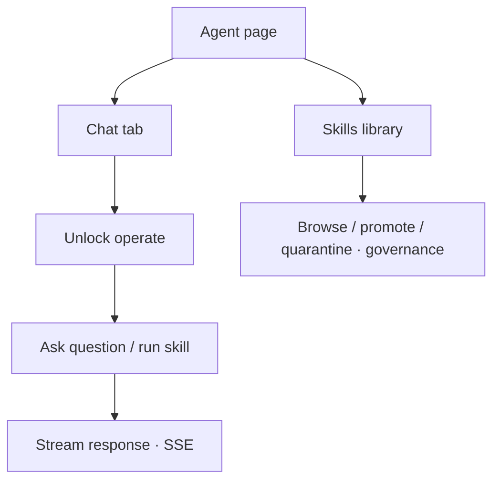

# Command Centre: Use Phantix Agent

**Where:** **Phantix Agent** → `/agent`

---

## Process flow

---

## Steps

1. Open **Phantix Agent**.
2. Confirm agent enabled for your plan.
3. Unlock operate for org-changing actions.
4. Send a prompt (status of scans, explain a risk, etc.).
5. Review streamed answer and any tool traces.
6. In **Skills**, review candidates before promoting.

---

## Notes

- Customer Agent ≠ Staff AGI Management (engagements/containers).
- Plan may return 402 if AI agent entitlement missing.
- To watch a live pentest advance through its methodology loop — including the
  trust-boundary and auth/access-matrix phases and the recon / autofix /
  verify-all subagents — see
  [17-autonomous-pentest.md](./17-autonomous-pentest.md).
