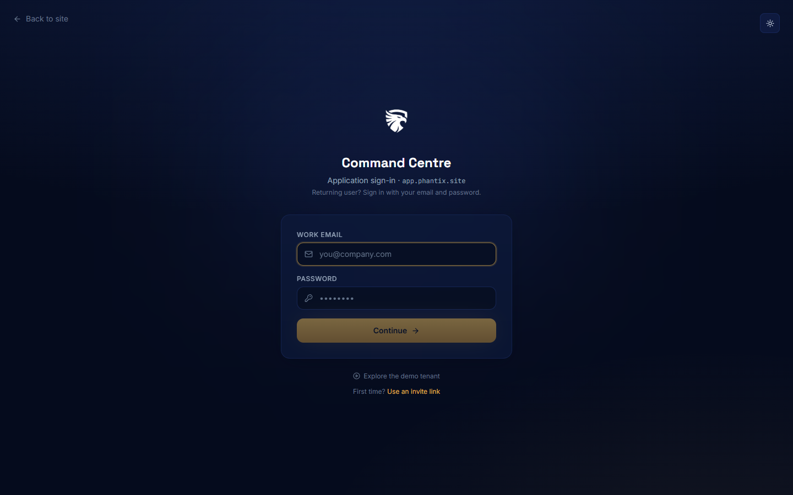

# Command Centre: Authorizer approvals

**Where:** **Authorizations** → `/authorizations`  
**Who:** Users marked authorizer on Platform



---

## Process flow

```text
Initiator requests protected action
 (campaign start, treatment, …)
        │
        ▼
 Item appears in Authorizer inbox
        │
        ▼
 Authorizer opens /authorizations
        │
        ▼
 Review detail → Approve or Reject
        │
        ▼
 Initiator continues workflow
```

---

## Steps

1. Sign in as the **authorizer** user.
2. Open **Authorizations** (or dashboard badge if shown).
3. Select pending item.
4. Read summary / risk.
5. **Approve** or **Reject** with operate session if required.
6. Confirm initiator can proceed (e.g. VAPT start).
