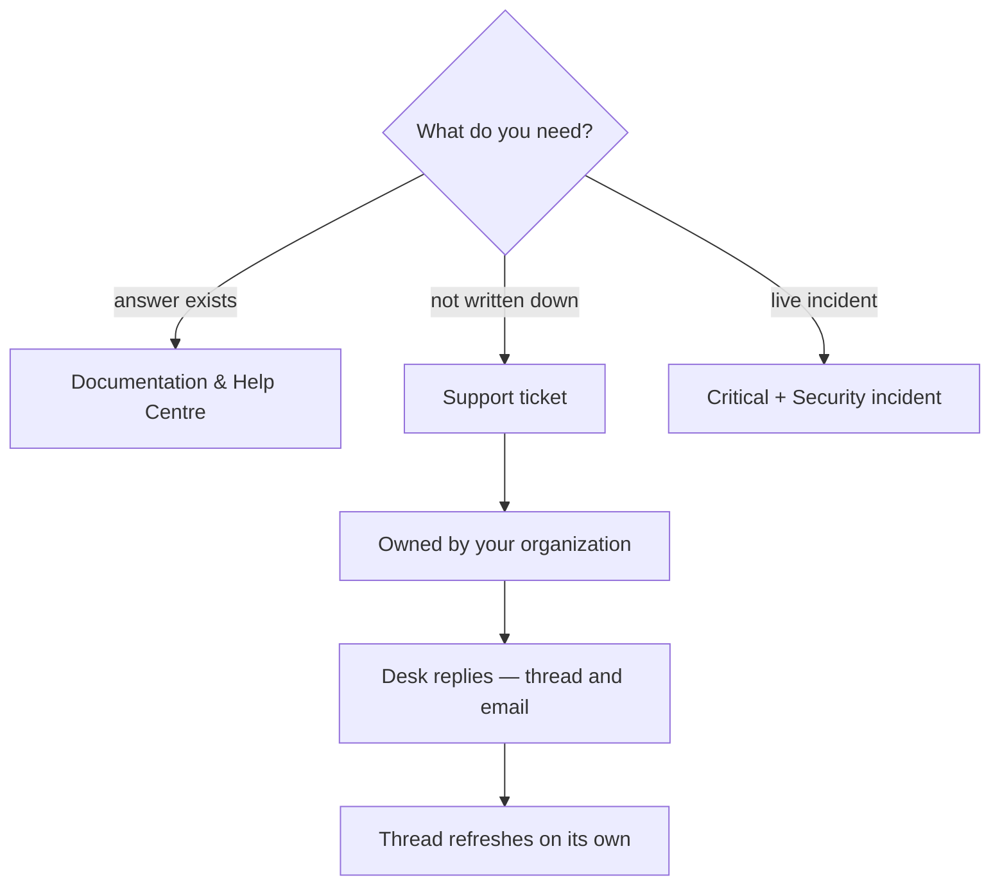

# Command Centre: Get help / open a support ticket

**Where:** **Support** → `/support` · or the **Support** switch in the assistant (bottom-right of every page)

---

## Process flow

---

## Anyone in the organization can raise one

Support is available to **every operator**, not only admins. A ticket is submitted
**on behalf of your organization** — so teammates can pick it up and the desk
answers the account — while the person who raised it is recorded as the submitter,
so support knows who to reply to.

---

## Real-time help

| Channel | Use it for |
|---------|-----------|
| **Start a ticket** | Anything not already answered. First response follows the priority you pick |
| **Email** | `support@phantixlabs.com` — include your org and any job / campaign / model IDs |
| **Documentation** | Setup, how-tos and FAQs — most answers are already written down |
| **Critical priority** | A live incident. Choose “Security incident” as the category and it is triaged first |

**First-response targets:** critical ~1 hour · high ~4 hours · medium ~1 business
day · low ~2 business days. The target for the priority you selected is shown on
the form before you submit, so the expectation is set up front.

---

## The thread updates itself

Once a ticket is open, the conversation refreshes every few seconds — a reply from
the desk appears without reloading the page. Reply from the same view; a
resolved or closed ticket is read-only, so reopen the issue as a new ticket rather
than replying into a closed one.

---

## From anywhere in the app

The floating assistant at the **bottom-right** has an **Agent ⇄ Support** switch.
Support mode gives you *Open a support ticket*, *Support centre*, *Documentation &
Help Centre* and email — so an issue routes to help without you having to find the
page.

---

## Notes

- Tickets live with your organization; staff answer from the staff portal.
- Email updates depend on your alert SMTP being configured.
- Attach context (job id, campaign id, model id, screenshot) — it is the difference
  between one reply and three.
