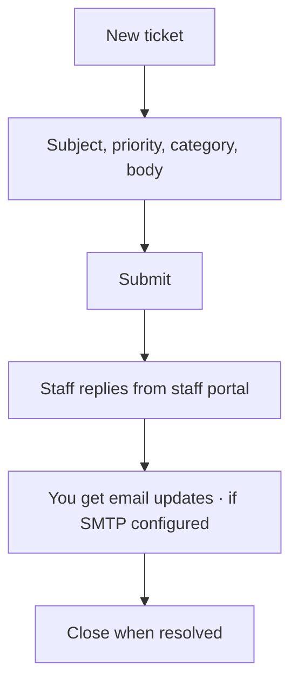

# Command Centre: Open a support ticket

**Where:** **Support** → `/support`

---

## Process flow

---

## Steps

1. Open **Support**.
2. Create ticket with clear subject and steps to reproduce.
3. Attach context (org slug, job id, screenshot).
4. Watch for staff replies.
5. Close or reopen as needed.
