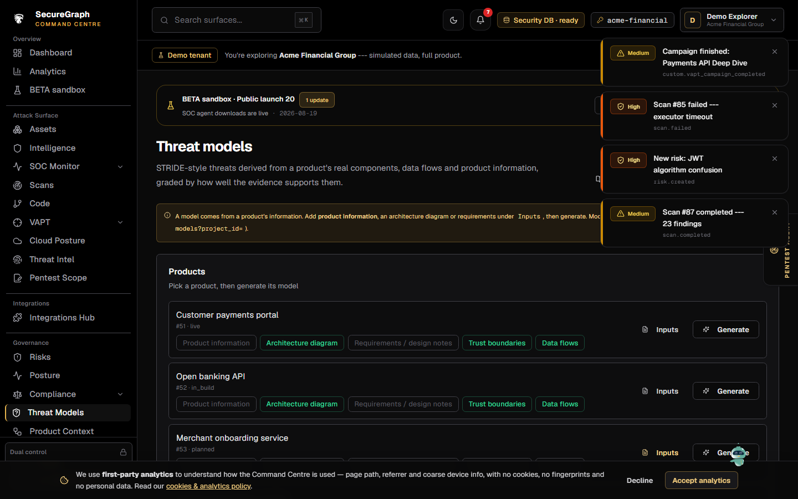
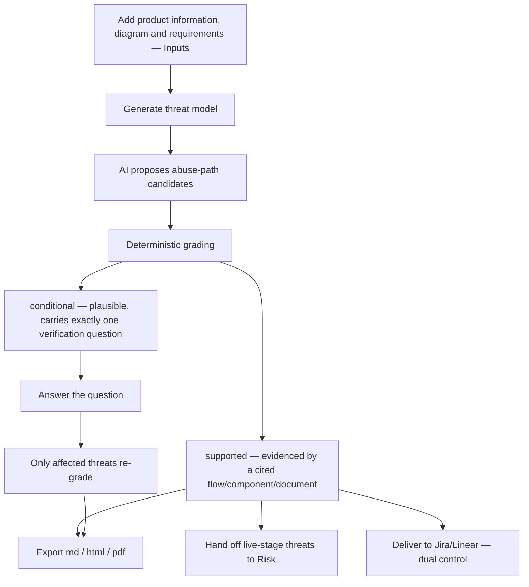

# Command Centre: Threat models

**Where:** **Threat models** → `/threat-models`
**What:** Evidence-graded, stage-aware threats derived from a product project's context (components, trust boundaries, flows, documents) — not a scanner result.



---

## Process flow



---

## The two grades

The grade is the product. Nothing is shown as confirmed unless a cited flow,
component, or document chunk supports it.

| Grade | Means | What the UI shows |
|-------|-------|-------------------|
| `supported` | Evidenced by a citation | A finding-strength item |
| `conditional` | Plausible, not yet evidenced | Its **one** verification question, with a way to answer it |

There is **no control that sets a grade** — grading is rule-computed from
evidence. A conditional with zero or two questions is an upstream bug; report it
rather than rendering it.

---

## Supply the product information first

A model reasons over the product's **inputs**. On **Threat models**, each
product row has an **Inputs** button (and **New product** creates one). The
Inputs panel is a readiness checklist:

| Input | What it is | How it is supplied |
|-------|------------|--------------------|
| **Product information** | Purpose, users, data handled, classification, compliance scope, entry points, trust boundaries, objectives, assumptions, out-of-scope | The structured form (saved as a `product_information` document) |
| **Architecture diagram** | Components, trust boundaries, flows | Upload a `.drawio` |
| **Requirements / design notes** | Security requirements, roles, data classification | Paste text |
| **Trust boundaries** | Zones the diagram marks trusted/untrusted | Parsed from the diagram |
| **Data flows** | Direction-aware flows between components | Parsed from the diagram |

The model needs **at least one** of product information, a diagram or
requirements — the panel says which input is still missing rather than queueing
a generation that cannot succeed. The full graph editor (search, re-upload,
component list) stays at **Product Context** (`/context`); the Inputs panel links
to it.

---

## Steps

1. **Threat models** → **New product** (or pick an existing row) → **Inputs** →
   fill in product information and/or upload the diagram / requirements until the
   checklist reads **Ready to generate**.
2. **Generate** (`POST /threat-models`). Generation is asynchronous (`202` +
   `task_id`). The list refreshes from `GET /threat-models?project_id=`; a `503`
   means no worker was available and nothing started — retry, don't wait.
3. Open the model and review `supported` and `conditional` threats separately.
4. **Answer** a conditional's verification question. Only the threats for that
   question re-grade (`re_graded_threat_ids`); everything else stays as a human
   left it. An answer of "unknown" leaves the question open.
5. **Export** as `md`, `html`, or `pdf`. A `pdf` `503` means the renderer is not
   installed on that deployment — offer `md`/`html` instead.
6. Set **owner** / **disposition** (`open` · `accepted` · `mitigated` ·
   `transferred` · `closed`).
7. For `live`-stage models, **hand off** supported threats to the Risk Engine.
   Accepted threats are not re-raised.
8. **Deliver** to Jira/Linear. This is dual-controlled — see below.

---

## Stage changes the framing, not the data

`planned` · `in_build` · `live`

A `planned` model describes **design decisions to take**, not defects to fix:
"Consider scoping payout to the owning account", not "Vulnerability: BOLA on
payout". The same model must not read as a design review in one place and an
incident report in another.

---

## Delivery shows "sent for approval"

`POST /threat-models/{id}/deliver` **does not deliver**. It is parked for an
authorizer:

```json
{ "detail": "Sensitive action requires authorizer approval",
  "pending": true, "pending_id": 481, "status": "pending",
  "authorizer_inbox": "/api/v1/authorizer/inbox" }
```

Treat `202` + `pending: true` as **sent for approval**, never "delivered". The
push happens when the authorizer approves it
([14-authorizer-approvals.md](./14-authorizer-approvals.md)).

---

## Notes

- The engine does not **prove** a threat — scanners and VAPT own execution. A
  threat is a hypothesis until one of them confirms it.
- It does not write findings or risks; a `live` `supported` threat is handed to
  the Risk Engine as input, and the Risk Engine decides.
- It does not push tickets itself — the Integrations Hub does, under dual control.
