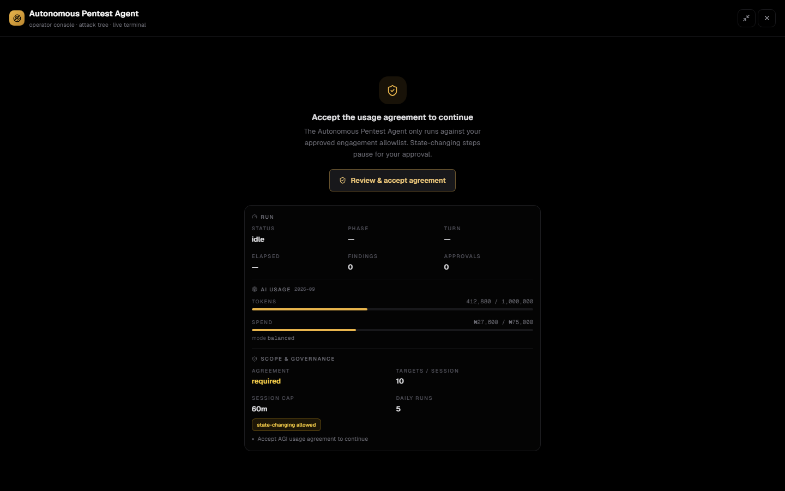

# Command Centre: Autonomous pentest agent

**Where:** **Phantix Agent** → **Autonomous pentest** console
**What:** A human-gated agent that walks a fixed methodology loop against an
approved scope: recon → discovery → trust boundaries → auth/access matrix →
vulnerability testing → exploit/verify → authenticated testing → report.

---

## Live pentest plan (to-do)

While a session runs, the console renders the engagement as a **checklist** that
ticks off as the agent advances. It is driven entirely by the backend
`session.job` (`public_progress_view`) — it mirrors what the runner actually
completed, it does not guess.

Each step shows its real status:

| Icon | Status | Meaning |
|------|--------|---------|
| ○ | `pending` | Not reached |
| ◐ (pulsing) | `in_progress` | Running now |
| ✓ (struck) | `satisfied` | Done |
| ⚠ | `blocked` | Waiting on an approval or missing info |
| ⊖ | `waived` | Skipped, with a reason |

Steps are grouped by the six methodology phases, with a progress bar and a
per-step "N of M assets" coverage line. It is pinned above the live stream in
the drawer and in the attack-tree pane of the fullscreen console.

---

## Discovery phases

Before vulnerability testing, the agent runs two discovery phases:

- **Identifying trust boundaries** — derives anon / user / admin / proxy zones
  from the product context and the org's provisioned test accounts.
- **Building auth/access matrix** — builds a principal × endpoint matrix, with
  IDOR/authorization test tags and read-only probes, using the labeled test
  accounts you provision.

Without labeled test accounts the matrix is guesswork; with them, "user A →
user B" and "user → admin" become concrete cells.

---

## Subagents

The agent delegates to bounded subagents, shown by name in the live stream:

| Subagent | Can do | Cannot do |
|----------|--------|-----------|
| **Recon subagent** | Read-only surface mapping (`http_get`, `dns_lookup`, `nmap_top`), trust boundaries, access matrix | Produce findings |
| **Autofix subagent** | Suggest ordered, class-specific remediation steps (advisory only) | Touch the target |
| **Verify-all gate** | Route every finding to exploit auditor / candidate verifier / exempt before the report | Silently upgrade a finding |

Nothing is reported without a verdict: exploit-bearing findings go to the
exploit auditor, low-signal ones to the candidate verifier, informational ones
are exempt.

---

## Retest after remediation

A finding's detail lets you **Retest** after a fix: the deterministic findings
check runs first, and only if it cannot decide does the AI engine judge the
finding from its stored evidence. See
[06-run-vapt-campaign.md](./06-run-vapt-campaign.md).

---

## Notes

- The agent is gated: state-changing actions are parked for an authorizer
  ([14-authorizer-approvals.md](./14-authorizer-approvals.md)).
- Pause/resume stops the loop; the plan keeps the last known statuses.
- A blocked step names why — an open approval or a missing info request.
