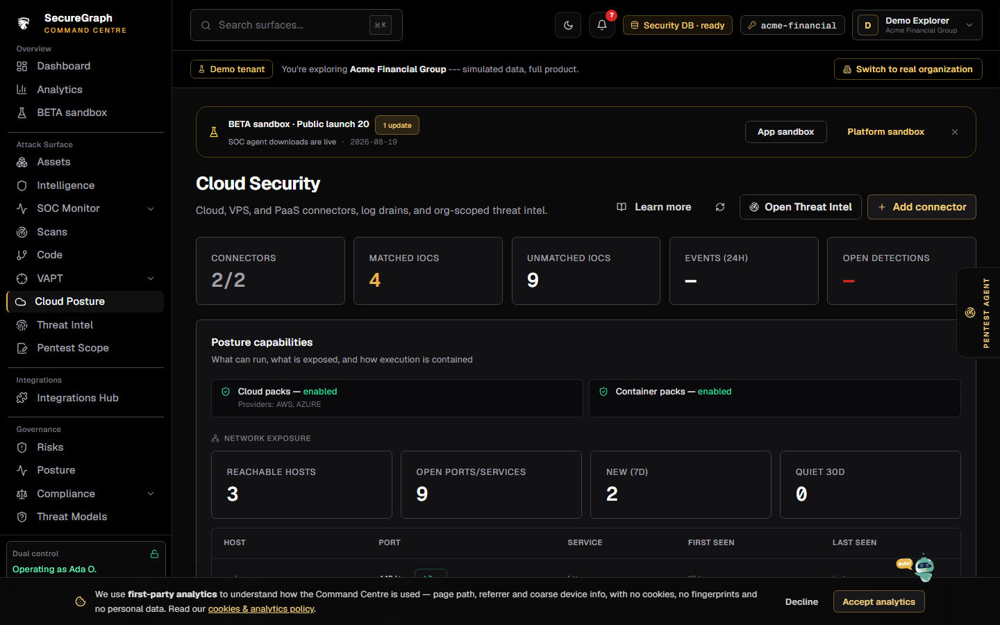
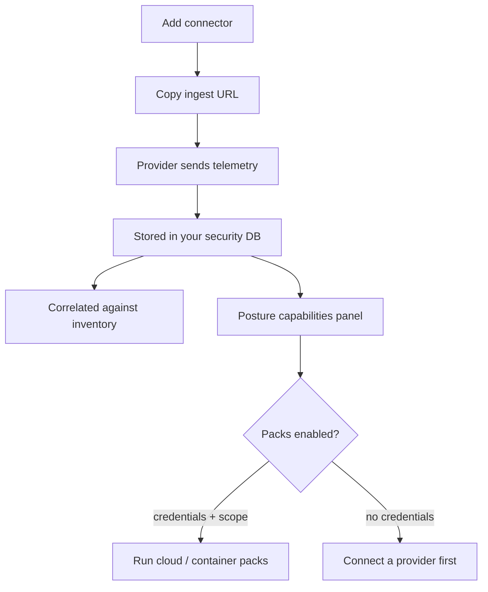

# Command Centre: Cloud posture

**Where:** **Cloud Posture** → `/cloud`
**What:** Cloud, VPS and PaaS connectors, log-drain ingest, and the five posture capabilities — which packs can actually run, what is exposed, TLS health, host baselines, and how execution is contained.

---

## Process flow

---

## Connect a provider

1. **Cloud Posture** → **Add connector**, pick the provider, label it.
2. Copy the **ingest URL** into the provider's webhook / log drain. Rotate the
   secret if it has ever been visible in a shared channel.
3. Enable or pause the connector per provider; deleting it stops ingest
   immediately but keeps events already stored.

A connector is the credential the posture packs read from. No connector, no cloud
pack — the panel says so rather than running a pack that can see nothing.

---

## The five capabilities

| Capability | What it answers |
|------------|-----------------|
| **Cloud / container packs** | Whether the pack can run, and the reason when it is held |
| **Network exposure** | Reachable hosts, ports and services with first-seen / last-seen |
| **TLS posture** | Legacy protocols, weak ciphers, certificate issues on public endpoints |
| **CIS-style host targets** | Host baselines available and how many matched |
| **Execution** | Docker isolation, concurrency, and the one-active-scan-per-org slot |

Each is a live answer, not a stored badge. A held pack shows the code the scanner
returned (`cloud_credentials_required`, `container_runtime_unavailable`).

---

## Exposure timelines

| Column | Means |
|--------|-------|
| **First seen** | The first scan that observed this port/service on this host |
| **Last seen** | The most recent scan that still found it |
| **State** | `open`, or `closed` when a later scan probed it and it was gone |

A closed port is kept, not deleted, so "was exposed, now it isn't" stays
answerable. A port nobody scanned stays unknown — it is never guessed as closed.

---

## Notes

- Telemetry and the exposure inventory live in **your** security database.
- The panel needs the scanner tool pack on your plan; if it is missing the card
  says so and offers **Retry** rather than disappearing.
