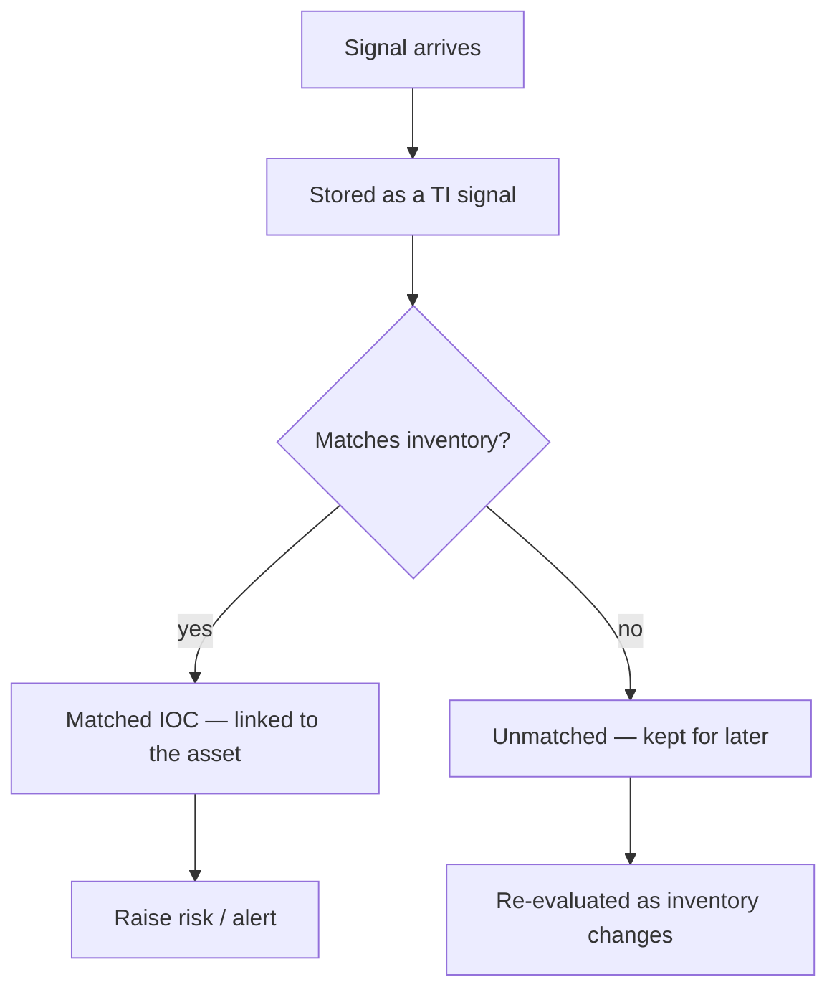

# Command Centre: Threat intelligence

**Where:** **Threat Intel** → `/threat-intel`
**What:** IOC lookup and correlation against your own inventory — indicators are matched to the assets you actually have, never to a generic feed dump.

---

## Process flow

---

## What you see

| Section | Means |
|---------|-------|
| **Matched IOCs** | An indicator that resolved to an asset in your inventory |
| **Unmatched IOCs** | No current asset — kept, and re-checked as inventory grows |
| **Signals** | The individual indicator rows, each with source and severity |
| **Events** | Raw connector/scan events that produced signals |

A match is only claimed when a signal and an asset genuinely line up. Unmatched
indicators are not silently dropped: they are the early warning before an asset
appears.

---

## Look up an indicator

1. **Threat Intel** → enter an IP, domain or hash.
2. Read the match state first, then the signals that produced it.
3. For a confirmed match, raise a risk or hand it to the agent for a write-up.

---

## Notes

- Signals are correlated in your security database; nothing is shared between
  organizations.
- A TI hit is context, not a finding. Scanners and VAPT own execution; a
  confirmed issue becomes a finding through those engines.
