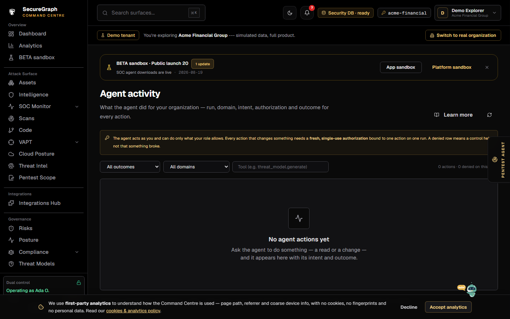
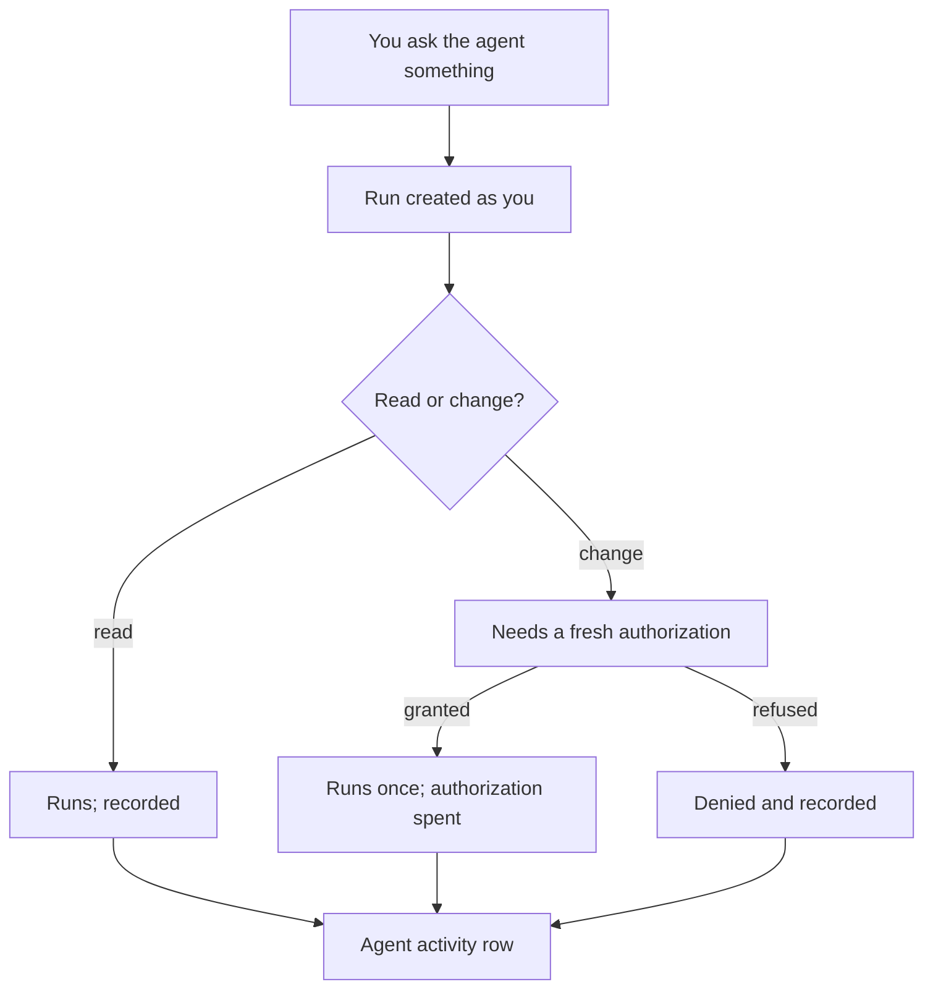

# Command Centre: Agent activity

**Where:** **Agent activity** → `/agent-activity`
**What:** Every action the agent took for your organization — the run, the domain, your intent, who asked, whether it was authorized, and what happened.

---

## Process flow

---

## Reading a row

| Column | Means |
|--------|-------|
| **When** | The moment the action ran, with the run id beneath |
| **Domain** | Which specialist acted (Chief, threat modelling, SOC, VAPT, code, …) |
| **Action** | The exact tool call |
| **Intent** | What you asked for, in your words |
| **Asked by** | The user the agent acted as; `org-level` when there was no named user |
| **Outcome** | `done`, or `denied` with the reason on expand |

Expand a row for the parameters (secrets redacted), the refusal reason, and the
evidence/response hashes.

---

## Why a denial is not an error

The agent acts as the signed-in user and inherits no authority. It can do only
what your role allows, and every action that changes something needs a **fresh,
single-use authorization** bound to one action on one run.

A `denied` row therefore means a control held. If you expected the action to run,
the reason tells you which one: a missing authorization, a role that lacks the
permission, or a tool outside the domain's policy.

---

## Notes

- Rows live in the platform audit store, never in your security database.
- Sensitive parameters are redacted before the row is written.
- A denied run still produced evidence — the agent continues with what it is
  allowed to read.
