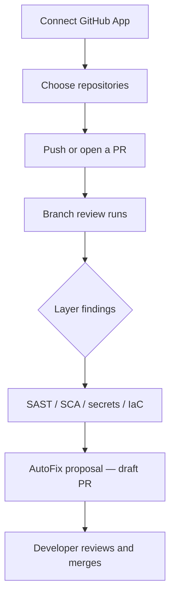

# Command Centre: Code security

**Where:** **Code** → `/code`
**What:** GitHub-connected repositories, branch/PR review runs, AutoFix proposals, and Continuous PR — code is analysed in an ephemeral clone, never stored by the platform.

---

## Process flow

---

## Tabs

| Tab | What it is |
|-----|------------|
| **Repositories** | Repos the GitHub App can read and review |
| **Pull requests** | Every branch-review run the reviewer processed |
| **AutoFix** | Block-scoped, verified fixes proposed for human review |
| **Continuous PR** | Prepare a same-repo branch and open a **draft** PR |

---

## Review requirements

- Only **verified** findings reach AutoFix, so an unverified heuristic can never
  open a pull request.
- The commit is signed by the app before it is pushed.
- The PR is always opened as a **draft**; a developer merges it. SecureGraph
  never merges on your behalf.
- Work happens in an ephemeral clone and is removed afterwards; source never
  lands on the platform.

---

## GitHub App permissions

Write scopes (`contents:write`, `pull_requests:write`) are requested **on demand**
— not provisioned by default. When a run needs one the response says so and gives
the re-consent URL, so you grant exactly what is required for that action.

---

## Notes

- Branch review and PR safety run before merge, not after an incident.
- AutoFix is credit-metered; viewing and exporting results is never billed.
