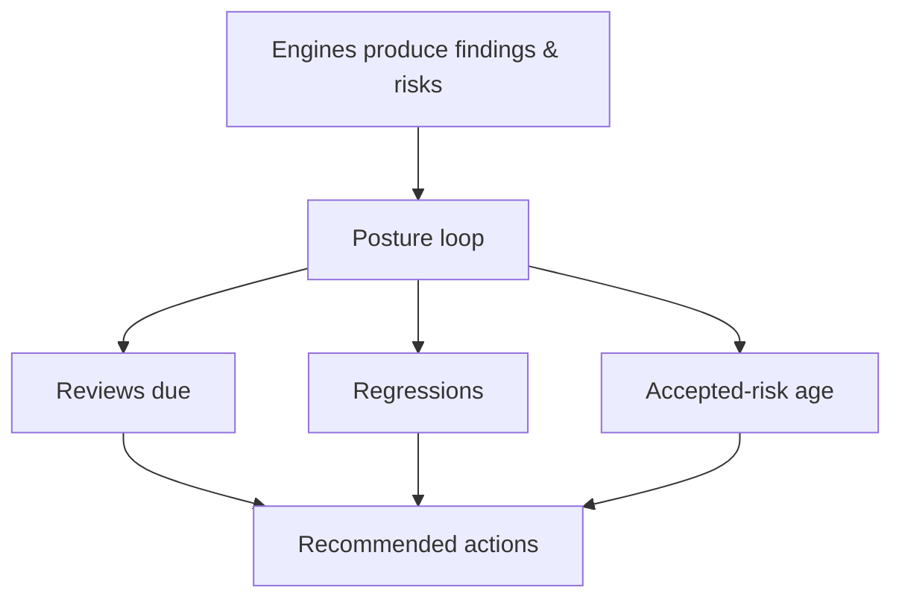

# Command Centre: Posture

**Where:** **Posture** → `/posture`
**What:** The continuous loop — what is due for review, what regressed, and the trend of accepted risk — assembled from every engine rather than a single scan.

---

## Process flow

---

## What it surfaces

| Panel | Means |
|-------|-------|
| **Reviews due** | Accepted risks whose next review date has arrived |
| **Regressions** | A closed issue that came back |
| **Accepted-risk age** | How long risk has been carried without re-examination |
| **Trend** | Whether posture is improving, flat or drifting |

---

## Working the loop

1. Open **Posture** and start with **Reviews due** — an acceptance is a decision,
   not a silence.
2. For each item, either **re-accept** with a new interval, or reopen it as work.
3. Check **Regressions** next: a returning issue means the earlier fix was
   incomplete, not that the scan is noisy.
4. Export or hand off anything that needs a report.

---

## Notes

- Posture reads the engines; it does not re-scan.
- An accepted risk that is never revisited is the most common way a posture
  quietly rots — the loop exists to prevent exactly that.
