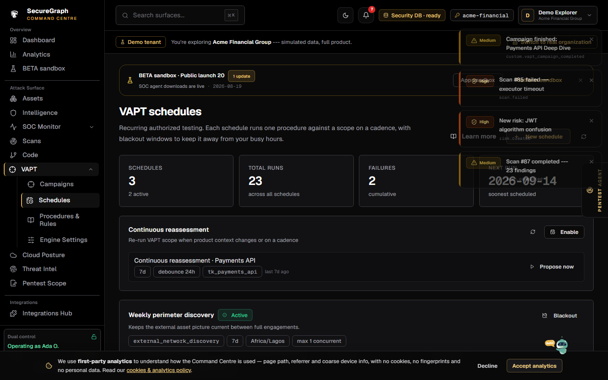
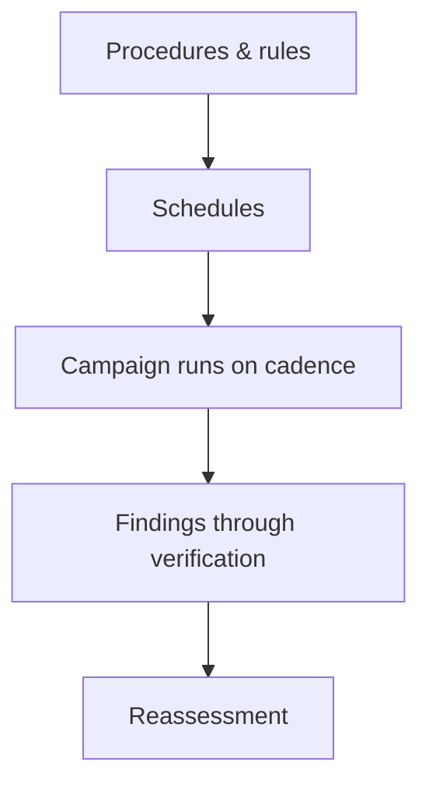

# Command Centre: VAPT schedules, procedures & settings

**Where:** **VAPT** → `/vapt/schedules` · `/vapt/procedures` · `/vapt/settings`
**What:** The cadence, the rules of engagement, and the engine configuration behind VAPT campaigns.

---

## Process flow

---

## Schedules

| Field | Means |
|-------|-------|
| **Target / scope** | The assets and environments this schedule may touch |
| **Cadence** | How often the campaign repeats |
| **Procedure** | Which rules of engagement apply |
| **Next run** | When the loop fires next |

A schedule without a procedure is a scan without rules — set the procedure first.

---

## Procedures & rules

Procedures are the rules of engagement: what may be tested, what is explicitly
out of scope, and which tests require approval before they run. They are
versioned, so a change to a rule does not retroactively rewrite what a past
campaign was allowed to do.

---

## Engine settings

Engine settings tune the engine's behaviour for your environment — concurrency,
timeouts, and the depth of the assessment. Change them with the same care as a
scope: a longer timeout is harmless, a wider scope is not.

---

## Continuous reassessment

A campaign can be set to reassess continuously, so a fixed issue is re-tested
rather than assumed fixed. Reassessment re-runs the relevant checks and updates
the finding's state; it does not create a duplicate.

---

## Adaptive procedures

A schedule can pick its procedure from the assets it will actually touch. On
each run the scope is classified (web app / API / GraphQL / infra / cloud / …)
and the procedure whose process flow matches is selected, so a weekly sweep of a
web estate runs the web flow and the same cadence pointed at an API estate runs
the API flow. The chosen procedure and the inferred surfaces are recorded on the
campaign for audit.

To pin a schedule to one procedure instead, turn off **Adaptive procedure** in
the New schedule modal (it is on by default) or set
`campaign_config.adaptive_procedure: false`; the schedule is then left exactly
as configured. An `adaptive` chip marks schedules that choose per run.

---

## Notes

- Continuous / recurring pentest is a Growth capability.
- Starting or changing a campaign is a mutating action — dual control applies.
