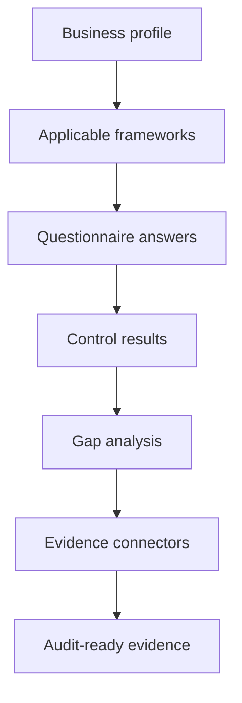

# Command Centre: Compliance review

**Where:** **Compliance** → `/compliance` · `/compliance/questionnaire` · `/compliance/gaps` · `/compliance/profile` · `/compliance/connectors`
**What:** Frameworks, the questions that scope them, the gaps they reveal, the business profile that drives them, and the connectors that collect evidence.

---

## Process flow

---

## Where each answer lives

| Page | What it is for |
|------|----------------|
| **Frameworks** | Which frameworks apply and their control coverage |
| **Questionnaire** | The scoping questions that decide applicability |
| **Gap analysis** | Controls you are not meeting, with the mapping that proves it |
| **Business profile** | Sector, jurisdictions and data handled — drives framework selection |
| **Evidence connectors** | Live collection into your security database |

---

## Getting from profile to gaps

1. Complete the **Business profile** — sector and jurisdiction decide which
   frameworks are relevant (for example a Nigerian fintech gets the CBN/NDPA
   set, not a generic ISO list).
2. Answer the **Questionnaire**. Questions are framework-tagged and can be edited
   from the staff portal, so what you see is what the engine will assess.
3. Read **Gap analysis**. Every gap names the control and the mapping behind it —
   a control failure is never invented.
4. Wire **Evidence connectors** so the evidence is collected continuously rather
   than assembled the week before an audit.

---

## Notes

- Compliance gaps are produced from Compliance Engine mappings only.
- Certification remains yours; SecureGraph builds the case, it is not the auditor.
