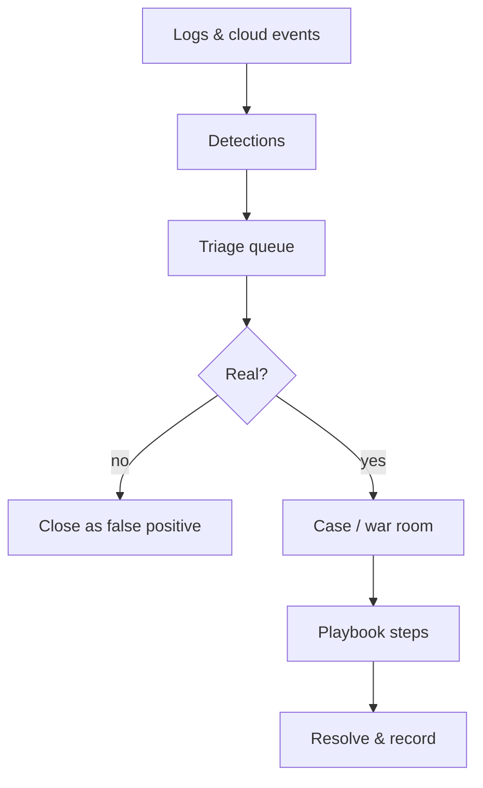

# Command Centre: SOC operations

**Where:** **SOC** → `/soc` · `/soc/war-room` · `/soc/playbooks` · `/soc/advisor` · `/soc/logs` · `/soc/agents` · `/soc/cloud`
**What:** Detection, triage, response and the analyst surfaces around them.

---

## Process flow

---

## Surfaces

| Page | Use it for |
|------|-----------|
| **SOC Dashboard** | The detection queue and current volume |
| **War Room** | Running an incident across phases with notes and owners |
| **Playbooks & MITRE** | The response steps and the techniques they cover |
| **Advisor** | Explaining a detection and suggesting next actions |
| **Log Pipeline** | Ingest health — whether events are arriving at all |
| **Agents** | Heartbeat/log-shipper installs for your hosts |
| **Cloud Integrations** | Cloud sources feeding detections |

---

## Triage that stays honest

1. Work the **queue** oldest-critical first.
2. Ask the **Advisor** to explain a detection — it reads the detection and its
   evidence; it does not invent an incident.
3. Escalate a real one into the **War Room**; assign an owner and work the
   **playbook** step by step.
4. Close with a disposition. A false positive is a result, not a failure — it
   feeds detection tuning.

---

## Notes

- Alert and SOC engines own detections; the agent explains, it never creates one.
- A silent **Log Pipeline** is the most common cause of "we saw nothing" — check
  ingest before assuming calm.
