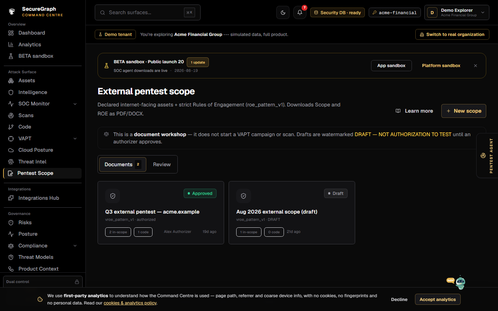
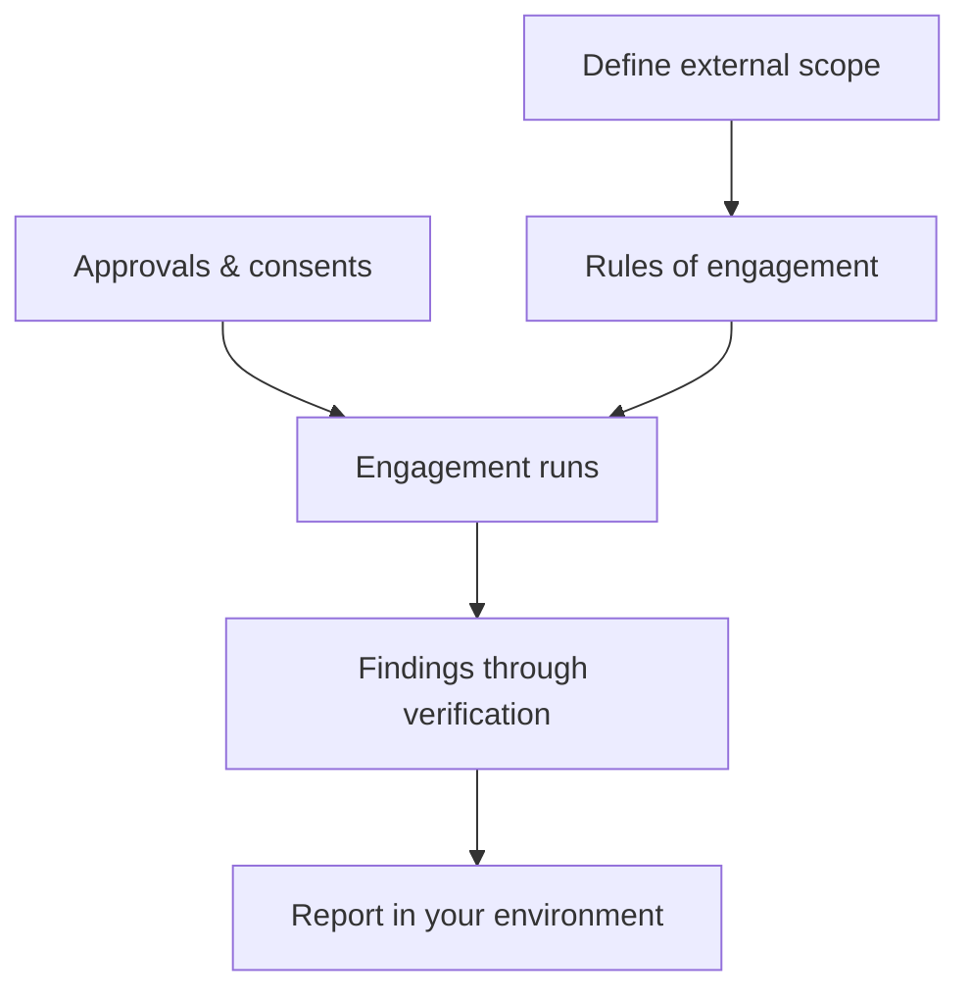

# Command Centre: Pentest scope

**Where:** **Pentest scope** → `/pentest/external-scope`
**What:** The external scope and rules of engagement for a human-assisted engagement, held inside your own workspace so every finding lands in one place.

---

## Process flow

---

## What you define

| Field | Means |
|-------|-------|
| **In-scope assets** | Hosts, apps and APIs the engagement may touch |
| **Out of scope** | Explicitly excluded systems |
| **Rules of engagement** | Windows, contacts, and what is never tested |
| **Approvals** | The acknowledgements required before the engagement can proceed |

An engagement cannot be approved while a required acknowledgement is missing —
that is a gate, not a warning.

---

## Why scope lives here

Running the engagement inside your SecureGraph workspace means the findings flow
through the same verification gate and impact analysis as your internal work.
You get one source of truth instead of stitching together reports from several
vendors.

---

## Notes

- Scope is immutable once the engagement starts; change it by opening a new one.
- Human-led engagements are quoted separately from subscription plans.
