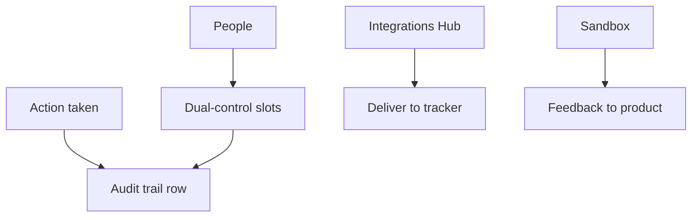

# Command Centre: Audit, people, integrations & sandbox

**Where:** **Audit trail** → `/audit` · **People** → `/people` · **Integrations Hub** → `/integrations` · **BETA sandbox** → `/sandbox`
**What:** The supporting surfaces — who did what, who is in the organization, where findings are delivered, and how to try new features safely.

---

## Process flow

---

## Audit trail

Every action is recorded with the initiator, the authorizer (when dual control
applied), the status and the timeline. Export as CSV for compliance. The trail is
append-only — nothing edits history.

---

## People

Invite users and set their role: view and reports by default; **initiator** and
**authorizer** slots are what unlock a mutating operate session. A user who is
neither can still read and export — that is the intended default, not a
limitation.

---

## Integrations Hub

Connectors that deliver findings outward — ticketing, chat, cloud. Delivery is
the outward-facing, un-retractable step, so it is parked for authorizer approval
before it runs.

---

## BETA sandbox

Enrolled organizations can try features before general release and rate them in
place. Feedback goes straight to the product team; sandbox data stays in your
tenant.

---

## Notes

- Findings are never delivered without approval.
- A user removed from the organization loses access immediately; their audit
  history remains.
