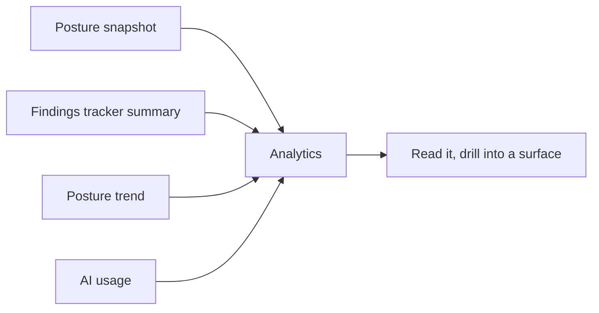

# Command Centre: Analytics

**Where:** **Analytics** → `/analytics`
**What:** The organization's security picture, live — posture, findings, comparative and automation panels — with nothing to generate and nothing to wait for.

---

## Process flow

---

## Analytics is not a report

A **report** is an artifact you generate, version, and hand to someone. **Analytics**
answers the same questions from the same engine data immediately. Use Analytics to
decide what to do; generate a report when you need to send it.

---

## What each panel answers

| Panel | Question it answers |
|-------|---------------------|
| **Overall posture** | Where do we stand, 0–100 across every surface? |
| **Open findings** | How much work is outstanding (open + in progress)? |
| **Fix rate** | Of everything tracked, how much is actually fixed? |
| **Regressions** | How many fixes did not hold? |
| **Surface scores** | Which surfaces carry the exposure — click one to filter |
| **Posture donut** | How is the score composed across surfaces |
| **Posture trend** | Which way are we moving over time |
| **Findings breakdown** | Magnitude and share, reframeable by status / severity / surface |
| **Comparative analysis** | Surfaces measured against each other — exposure composition and where remediation work sits |
| **Automation** | What the platform's own AI work is costing |

---

## Reading it honestly

- Each panel reads an endpoint that already exists. A source that is unavailable
  leaves the rest of the page intact rather than blanking it.
- A panel with no data **says so** instead of drawing an empty axis — an empty
  chart reads as "zero" when it usually means "not measured yet".
- The severity composition shows `other` for what the posture snapshot does not
  break out, rather than inventing a medium/low split.
- Posture history appears once there are two or more snapshots; a single point is
  not a trend.

---

## Notes

- Nothing here is credit-metered: viewing and analysing is never billed.
- Analytics reflects the same engines that produce findings and reports, so the
  numbers agree with the tracker by construction.
