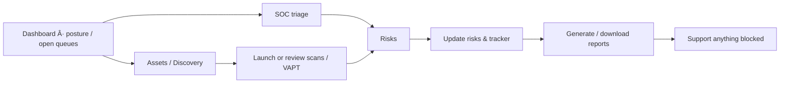

# Command Centre how-tos

**App:** https://app.phantixlabs.com  
**Who:** Security operators  
**Does:** Assets, SOC, scans, VAPT, risks, compliance, reports, agent.

Platform must have setup complete + security DB bootstrapped first.

## Index

| # | Task | Doc |
|---|------|-----|
| 1 | Sign in | [01-sign-in.md](./01-sign-in.md) |
| 2 | Unlock operate | [02-unlock-operate.md](./02-unlock-operate.md) |
| 3 | Add & verify assets | [03-add-and-verify-assets.md](./03-add-and-verify-assets.md) |
| 4 | Run discovery | [04-run-discovery.md](./04-run-discovery.md) |
| 5 | Launch a scan | [05-launch-a-scan.md](./05-launch-a-scan.md) |
| 6 | Run a VAPT campaign | [06-run-vapt-campaign.md](./06-run-vapt-campaign.md) |
| 7 | Triage SOC detections | [07-triage-soc.md](./07-triage-soc.md) |
| 8 | Availability monitoring & agent | [08-availability-monitoring.md](./08-availability-monitoring.md) |
| 9 | Manage risks | [09-manage-risks.md](./09-manage-risks.md) |
| 10 | Run compliance assessment | [10-compliance-assessment.md](./10-compliance-assessment.md) |
| 11 | Generate reports | [11-generate-reports.md](./11-generate-reports.md) |
| 12 | Findings tracker | [12-findings-tracker.md](./12-findings-tracker.md) |
| 13 | Use Phantix Agent | [13-use-phantix-agent.md](./13-use-phantix-agent.md) |
| 14 | Authorizer approvals | [14-authorizer-approvals.md](./14-authorizer-approvals.md) |
| 15 | Open a support ticket | [15-support-ticket.md](./15-support-ticket.md) |
| 16 | Threat models | [16-threat-models.md](./16-threat-models.md) |
| 17 | Autonomous pentest agent | [17-autonomous-pentest.md](./17-autonomous-pentest.md) |
| 18 | Cloud posture | [18-cloud-security.md](./18-cloud-security.md) |
| 19 | Threat intelligence | [19-threat-intel.md](./19-threat-intel.md) |
| 20 | Agent activity | [20-agent-activity.md](./20-agent-activity.md) |
| 21 | Code security | [21-code-security.md](./21-code-security.md) |
| 22 | Posture | [22-posture.md](./22-posture.md) |
| 23 | VAPT schedules & settings | [23-vapt-schedules.md](./23-vapt-schedules.md) |
| 24 | Compliance review | [24-compliance-review.md](./24-compliance-review.md) |
| 25 | SOC operations | [25-soc-operations.md](./25-soc-operations.md) |
| 26 | Pentest scope | [26-pentest-scope.md](./26-pentest-scope.md) |
| 27 | Audit, people & integrations | [27-admin-and-audit.md](./27-admin-and-audit.md) |

## Typical weekly operating flow

Screenshots: `../../screenshots/app/`
