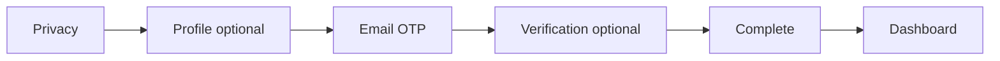

# Platform: Complete the setup wizard

**Where:** `/setup` (auto after first login)  
**Goal:** Mark the organization setup complete so product modules can run.


---

## Process flow

```text
GET /organizations/me/setup  →  which step is next?
         │
         ▼
 ┌───────┴────────┐
 │ 1. Privacy     │  ← required  (accept notice)
 │ 2. Profile     │  ← optional  (legal name, website…)
 │ 3. Email OTP   │  ← required  (verify contact email)
 │ 4. Company     │  ← optional  (DNS / file / CAC / manual)
 │    verification│
 │ 5. Complete    │  ← finish
 └────────────────┘
         │
         ▼
 setup_complete = true  →  /dashboard
```



---

## Steps

1. Open Platform after sign-in. If setup is incomplete you stay on **Organization setup**.
2. **Privacy notice** — read and accept (required).
3. **Company profile** — fill optional identity fields; continue.
4. **Email verification** — request OTP, enter code (required to finish).
5. **Company verification** (optional):
   - DNS TXT, or  
   - HTTP well-known file, or  
   - CAC / registration details, or  
   - Request **manual review** (staff approves later)
6. Click **Complete** when required steps show done.
7. You should land on **Dashboard** with progress 100%.

---

## Tips

- Domain / CAC verification is **not** required to use Command Centre if privacy + email are done and security DB is bootstrapped.
- Rehydrate always comes from the API; refreshing the page resumes the correct step.
