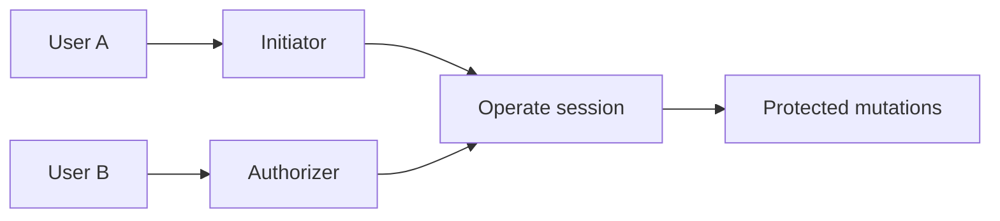

# Platform: Assign dual-control (initiator & authorizer)

**Where:** **People & Control** → dual-control section  
**Why:** Sensitive writes (scans, DB changes, many mutations) require a short-lived operate session from initiator or authorizer.


---

## Process flow

```text
Need ≥ 2 active org users
         │
         ▼
 Designate INITIATOR  (proposes / starts operate)
 Designate AUTHORIZER (second pair of eyes / can also operate per policy)
         │
         ▼
 Save dual-control configuration
         │
         ▼
 Later: Unlock operate → email OTP → X-Dual-Control-Session on mutations
```



---

## Steps

1. Create at least **two** people ([03-add-a-user.md](./03-add-a-user.md)).
2. Open **People & Control**.
3. In dual-control settings:
   - Set **Initiator** to one user  
   - Set **Authorizer** to a **different** user  
4. Save.
5. Confirm the dashboard checklist shows dual-control configured.

---

## Rules of thumb

| Role | Typical duty |
|------|----------------|
| Initiator | Starts operate session, runs day-to-day protected actions |
| Authorizer | Second controller; approvals inbox on Command Centre when required |

- Same person cannot fill both slots.
- Operate sessions idle out; unlock again when expired.
- Reads usually do **not** need dual-control; writes often do.

**Next:** [09-unlock-operate.md](./09-unlock-operate.md)
