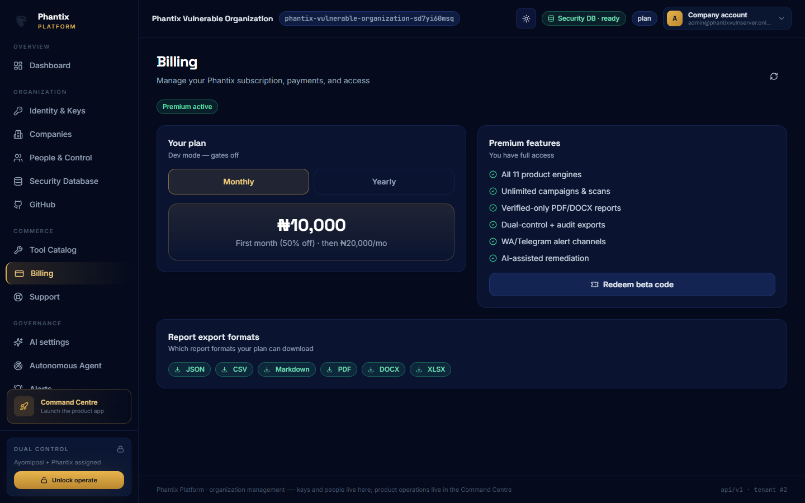
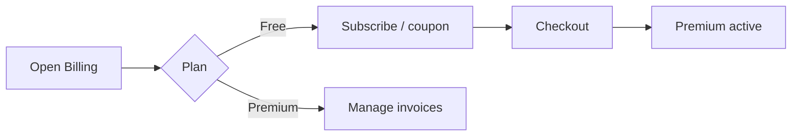

# Platform: Billing and subscribe

**Where:** **Billing** → `/billing`



---

## Process flow

```text
Billing page
    │
    ├─► View plan + invoices
    ├─► Subscribe monthly / yearly
    │      → checkout (Paystack)
    │      → return → active entitlement
    ├─► Pay open invoice
    └─► Redeem coupon / beta code
```



---

## Steps

### Subscribe
1. Open **Billing**.
2. Choose monthly or yearly.
3. Complete payment checkout.
4. Confirm plan badge updates on the dashboard.

### Redeem coupon
1. Enter beta/coupon code.
2. Apply → Premium / tools unlock per coupon rules.

### Pay invoice
1. Open unpaid invoice.
2. Pay via gateway.
3. Confirm status **paid**.

---

## When you see HTTP 402

A Command Centre or Platform action needs a paid entitlement. Return here to upgrade, then retry the action.
