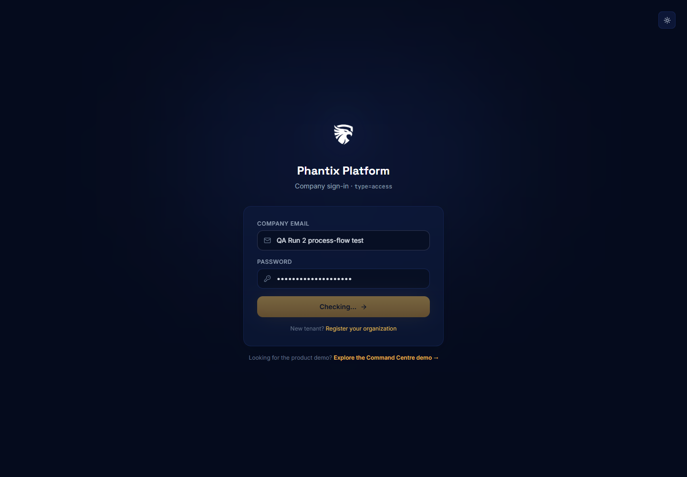

# Platform: Configure alert channels

**Where:** **Alerts** → `/alerts`  
**Also:** Command Centre may show delivery events; SMTP for app OTPs may overlap org settings.



---

## Process flow

```text
Alerts settings
    │
    ├─► Enable alerts
    ├─► SMTP
    │     host, port, from, TLS
    │     test email
    ├─► Email recipients list
    ├─► WhatsApp (if enabled)
    └─► Telegram (if enabled)
    │
    ▼
 Save → send test → confirm delivery
```

---

## Steps

1. Platform → **Alerts**.
2. Turn **alerts enabled** on.
3. Configure **SMTP** (your org mail relay or provider).
4. Add **email recipients**.
5. Optionally enable WhatsApp / Telegram providers and recipients.
6. Save (operate if required).
7. **Send test** alert.
8. Confirm inbox / channel received the test.

---

## Tips

- Login OTPs and product alerts may use different paths; keep SMTP healthy for MFA.
- Critical SOC / availability events respect these channels when configured.
